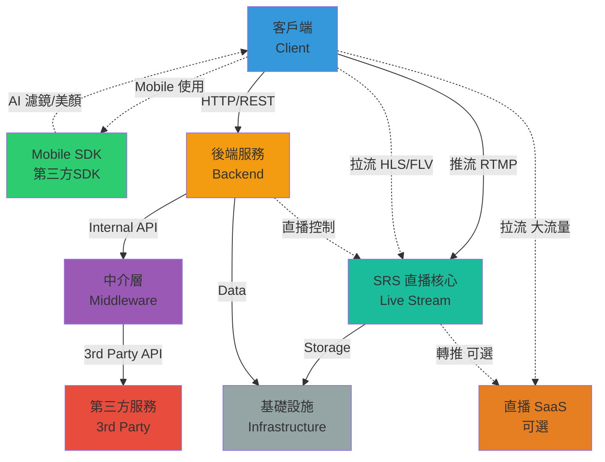
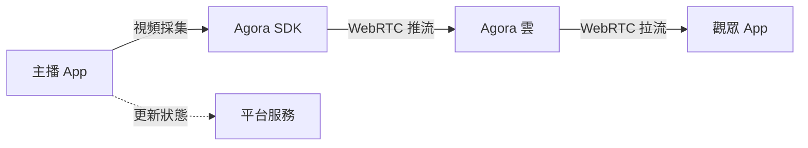
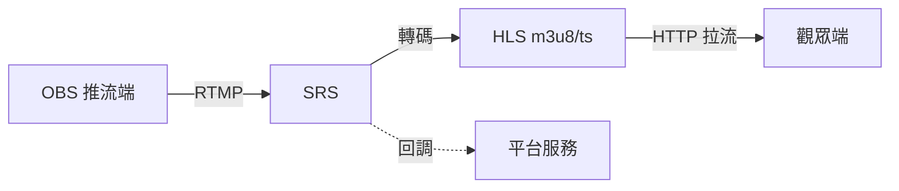
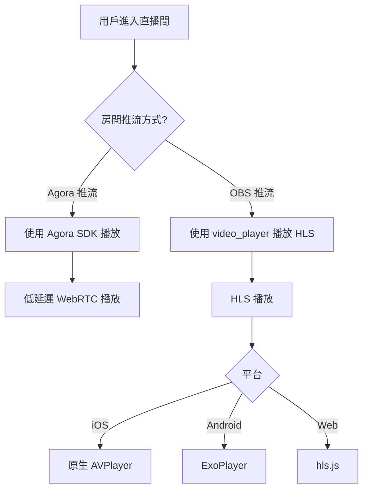
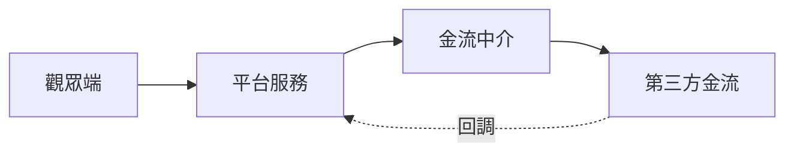
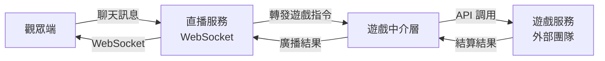

# 直播平台系統架構圖

> 本文檔描述直播平台的整體架構設計

## 整體架構

## 架構說明

### 1. 客戶端 (Client)
Web 端、Mobile 端、OBS 推流、管理後台

### 2. Mobile SDK
第三方 SDK（騰訊雲、聲網等），提供 AI 濾鏡、美顏等功能

### 3. 後端服務 (Backend)
平台服務、用戶服務、內容服務、推薦服務等核心業務邏輯

### 4. 中介層 (Middleware)
金流中介、**遊戲中介**、聊天中介、通知中介，統一對接第三方

### 5. 第三方服務 (3rd Party)
- **金流服務**: 支付寶、微信支付等
- **💜 遊戲服務（獨立主理）**: 外部遊戲團隊提供的遊戲平台（透過聊天室訊息參與遊戲）
  - **重要**: 遊戲服務作為專案的主要組件之一，會大量更新迭代
  - **開發模式**: 獨立主理，貫穿整個專案開發週期
  - **對接方式**: 透過遊戲中介層統一對接
  - **顏色標記**: 💜 紫色系
- **IM 服務**: 即時通訊服務
- **推播服務**: 推播通知服務

### 6. SRS 直播核心 (Live Stream)
接收推流、轉碼、提供拉流、錄製（小規模直用 / 大規模轉推 SaaS）

### 7. 直播 SaaS (可選)
阿里雲/騰訊雲等雲端直播服務，用於大流量 (> 1000 並發)

### 8. 基礎設施 (Infrastructure)
Database、Redis、MQ、OSS 等基礎存儲和中間件

## 數據流向

### 推流流程 1：鏡頭推流（使用 Agora SDK）

- **延遲**: < 1 秒
- **適用**: 連麥、PK、互動直播
- **平台**: iOS、Android、Web
- **使用**: `agora_rtc_engine` package

### 推流流程 2：OBS 推流（使用 SRS）

- **延遲**: 3-10 秒
- **適用**: 單向直播、高畫質直播
- **平台**: iOS、Android、Web
- **使用**: `video_player` package

### 觀看流程對比

| 推流方式 | 拉流協議 | Flutter Package | 延遲 | 成本 | 互動性 |
|---------|---------|----------------|------|------|--------|
| Agora 鏡頭推流 | WebRTC | agora_rtc_engine | < 1s | 高 | ✅ |
| OBS 推流 | HLS | video_player | 3-10s | 低 | ❌ |

### 播放器選擇邏輯

### 打賞流程

### 遊戲互動流程

**說明**:
- 觀眾透過直播間聊天室發送訊息參與遊戲
- 直播服務識別遊戲指令並轉發至遊戲中介層
- 遊戲中介層統一對接外部遊戲服務 API
- 遊戲服務處理遊戲邏輯並回傳結算結果
- 結算結果透過 WebSocket 廣播給直播間所有觀眾

## 核心特點

- **高可用**: 微服務架構 + SRS 集群
- **可擴展**: 各服務獨立擴展 + 彈性接入 SaaS
- **靈活**: 中介層解耦第三方依賴，雙推流模式並存
- **高性能**: SRS 直播核心 + Redis 緩存
- **成本優化**: OBS 推流用 SRS（低成本），互動直播用 Agora（低延遲）

## 技術細節

### HLS 播放器優化（針對 OBS 推流）
- **重試機制**: 最多重試 3 次，間隔 3 秒
- **Web 優化**: 初始化前檢查 m3u8 可用性，避免無效請求
- **跨平台支持**: 
  - iOS: 原生 HLS 支持（最穩定）
  - Android: ExoPlayer HLS 支持
  - Web: hls.js 支持（需額外檢查）

### Agora SDK 集成（針對鏡頭推流）
- **推流**: `AgoraRtcEngine.startPreview()` + `joinChannel()`
- **拉流**: `joinChannel()` + 訂閱遠端流
- **平台支持**: iOS、Android 完整支持，Web 需 HTTPS

### 直播間管理邏輯
- **用戶限制**: 一個用戶只能創建一個直播間
- **身份識別**: 基於用戶名（nickname）識別，無需註冊
- **狀態管理**:
  - `idle`: 直播間存在但未推流（觀眾看不到畫面）
  - `live`: 正在直播中（觀眾可以觀看）
- **關閉機制**:
  - **停止直播** (status=idle): 直播間保留，觀眾看到友好提示
  - **關閉直播間** (DELETE): 清除內存數據，WebSocket 通知所有觀眾，自動踢出並返回首頁

### WebSocket 事件系統
- **聊天消息**: 實時聊天功能
- **房間關閉通知**: `room_closed` 事件廣播到所有連接的觀眾
- **自動清理**: 刪除房間時自動關閉所有 WebSocket 連接

---

**版本**: 3.2  
**更新日期**: 2026-01-13  
**主要變更**: 
- 新增雙推流模式架構說明（Agora + SRS）
- 新增直播間管理邏輯（用戶限制、狀態管理、關閉機制）
- 新增 WebSocket 事件系統
- 新增遊戲服務架構說明（透過聊天室參與遊戲，外部團隊提供遊戲服務）
- **遊戲服務獨立主理**：遊戲服務作為專案主要組件，獨立規劃與開發

