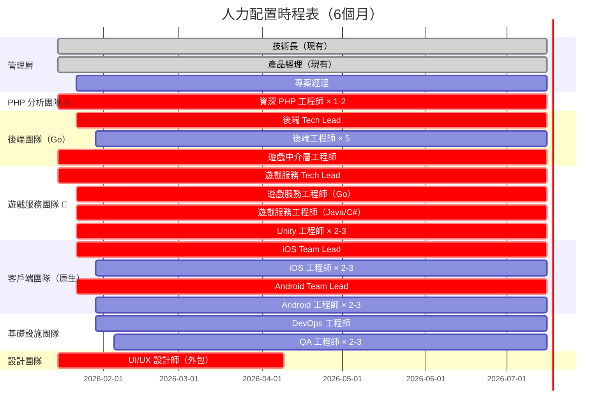

# 人力資源配置計劃（6 個月壓縮版）

> **版本**: v1.0  
> **制定日期**: 2026-01-13  
> **技術棧**: Go 後端 + 原生 iOS/Android + PHP 分析 + 遊戲服務（Go/Java/C# + Unity）

---

## 📊 人力配置總覽

### 團隊規模
- **總人數**: 28-35 人
- **內部團隊**: 26-33 人
- **外包團隊**: 2 人（UI/UX）

### 技術棧明確化
- **後端**: Go（明確）
- **客戶端**: 原生 iOS（Swift/Objective-C）+ 原生 Android（Kotlin/Java）
- **PHP 分析**: 資深 PHP 工程師（瓶頸分析）
- **遊戲服務**: Go/Java/C# + Unity

---

## 👥 詳細人力配置表

### 1. 管理層（3 人）

| 角色 | 人數 | 技術棧 | 職責 | 招聘狀態 | 優先級 | 到位時間 |
|------|------|--------|------|----------|--------|----------|
| 技術長 | 1 | - | 整體架構設計、直播技術研究、團隊管理 | ✅ 現有 | - | Week 1 |
| 產品經理 | 1 | - | 需求管理、優先級排序 | ✅ 現有 | - | Week 1 |
| 專案經理 | 1 | - | 協調、進度追蹤、風險管理 | 🔍 待招聘 | P1 | Week 2 |

**月成本**: $10,000-30,000  
**6 個月成本**: $60,000-180,000

---

### 2. PHP 分析團隊（1-2 人）🔥 關鍵

| 角色 | 人數 | 技術棧 | 職責 | 招聘狀態 | 優先級 | 到位時間 |
|------|------|--------|------|----------|--------|----------|
| **資深 PHP 工程師** | **1-2** | **PHP** | **代碼審查、性能瓶頸分析、優先抽換模組識別** | 🔍 待招聘 | **P0** | **Week 1** |

**關鍵職責**:
- Week 1: 立即到位，開始代碼審查
- Week 1-2: 深度分析現有 PHP 代碼
- Week 2: 產出瓶頸分析報告
- Week 2: 產出優先抽換模組清單
- 持續: 協助後端團隊理解現有系統邏輯

**月成本**: $6,000-20,000  
**6 個月成本**: $36,000-120,000

**重要性**: ⭐⭐⭐⭐⭐ 極高 - 決定開發優先級，影響整個專案時程

---

### 3. 後端團隊 - Go（7 人）

| 角色 | 人數 | 技術棧 | 職責 | 招聘狀態 | 優先級 | 到位時間 |
|------|------|--------|------|----------|--------|----------|
| 後端 Tech Lead | 1 | Go | 微服務架構、技術選型、代碼審查 | 🔍 待招聘 | P0 | Week 2 |
| 後端工程師（認證服務） | 1 | Go | 認證服務開發 | 🔍 待招聘 | P0-P1 | Week 3 |
| 後端工程師（用戶服務） | 1 | Go | 用戶服務開發 | 🔍 待招聘 | P0-P1 | Week 3 |
| 後端工程師（房間服務） | 1 | Go | 房間服務開發 | 🔍 待招聘 | P0-P1 | Week 3 |
| 後端工程師（直播服務） | 1-2 | Go | 直播服務開發 | 🔍 待招聘 | P0-P1 | Week 3-4 |
| 後端工程師（支付服務） | 1 | Go | 支付服務開發 | 🔍 待招聘 | P1 | Week 4 |
| 遊戲中介層工程師 | 1 | Go | 💜 遊戲中介層開發（獨立主理） | 🔍 待招聘 | P0 | Week 1 |

**月成本**: $35,000-56,000  
**6 個月成本**: $210,000-336,000

**開發分配**:
- 每人負責 1 個微服務
- 遊戲中介層工程師獨立主理（Week 1-26）

---

### 4. 遊戲服務團隊（6-8 人）💜 獨立主理

| 角色 | 人數 | 技術棧 | 職責 | 招聘狀態 | 優先級 | 到位時間 |
|------|------|--------|------|----------|--------|----------|
| **遊戲服務 Tech Lead** | **1** | **Go/Java/C#** | **遊戲服務架構設計、技術選型** | 🔍 待招聘 | **P0** | **Week 1** |
| **遊戲服務工程師（Go）** | **1-2** | **Go** | **遊戲服務後端開發** | 🔍 待招聘 | **P0** | **Week 2-3** |
| **遊戲服務工程師（Java）** | **1** | **Java** | **遊戲服務後端開發** | 🔍 待招聘 | **P0** | **Week 2-3** |
| **遊戲服務工程師（C#）** | **1** | **C#** | **遊戲服務後端開發** | 🔍 待招聘 | **P0** | **Week 2-3** |
| **Unity 工程師** | **2-3** | **Unity/C#** | **遊戲前端開發、遊戲邏輯實現** | 🔍 待招聘 | **P0** | **Week 2-3** |

**月成本**: $30,000-72,000  
**6 個月成本**: $180,000-432,000

**開發分配**:
- Tech Lead: 架構設計與技術選型
- 後端工程師: 遊戲服務後端開發（Go/Java/C# 並行）
- Unity 工程師: 遊戲前端開發（2-3 人並行）

**獨立主理**: Week 1-26 持續開發，不影響主線

---

### 5. 客戶端團隊 - 原生 iOS/Android（6-8 人）

| 角色 | 人數 | 技術棧 | 職責 | 招聘狀態 | 優先級 | 到位時間 |
|------|------|--------|------|----------|--------|----------|
| iOS Team Lead | 1 | Swift/Objective-C | iOS 架構設計、代碼審查 | 🔍 待招聘 | P0 | Week 2 |
| iOS 工程師 | 2-3 | Swift/Objective-C | iOS 原生開發 | 🔍 待招聘 | P1 | Week 3-4 |
| Android Team Lead | 1 | Kotlin/Java | Android 架構設計、代碼審查 | 🔍 待招聘 | P0 | Week 2 |
| Android 工程師 | 2-3 | Kotlin/Java | Android 原生開發 | 🔍 待招聘 | P1 | Week 3-4 |

**月成本**: $30,000-64,000  
**6 個月成本**: $180,000-384,000

**開發分配**:
- iOS 和 Android 完全並行開發
- 使用原生技術棧（不使用跨平台框架）

---

### 6. 基礎設施團隊（3-5 人）

| 角色 | 人數 | 技術棧 | 職責 | 招聘狀態 | 優先級 | 到位時間 |
|------|------|--------|------|----------|--------|----------|
| DevOps 工程師 | 1-2 | Docker/K8s | CI/CD、環境部署、監控 | 🔍 待招聘或外包 | P1 | Week 3 |
| QA 工程師 | 2-3 | - | 測試計畫、自動化測試、執行測試 | 🔍 待招聘或外包 | P2 | Week 4-5 |

**月成本**: $12,000-30,000  
**6 個月成本**: $72,000-180,000

---

### 7. 設計團隊（1-2 人，外包）

| 角色 | 人數 | 技術棧 | 職責 | 招聘狀態 | 優先級 | 到位時間 |
|------|------|--------|------|----------|--------|----------|
| UI/UX 設計師 | 1-2 | Figma/Sketch | 原型圖、UI 設計 | 🔍 外包 | P0 | Week 1 |

**月成本**: $3,000-10,000  
**6 個月成本**: $18,000-60,000

---

## 💰 成本總覽

### 月度成本

| 團隊 | 人數 | 月成本 |
|------|------|--------|
| 管理層 | 2-3 | $10,000-30,000 |
| PHP 分析團隊 | 1-2 | $6,000-20,000 |
| 後端團隊（Go） | 7 | $35,000-56,000 |
| 遊戲服務團隊 | 6-8 | $30,000-72,000 |
| 客戶端團隊（原生） | 6-8 | $30,000-64,000 |
| 基礎設施團隊 | 3-5 | $12,000-30,000 |
| 設計團隊 | 1-2 | $3,000-10,000 |
| **總計** | **28-35** | **$126,000-282,000** |

### 6 個月總成本

| 項目 | 成本 |
|------|------|
| **人力成本** | **$756,000-1,692,000** |
| 基礎設施成本 | $7,800-15,600 |
| 第三方服務成本 | $24,000-69,000 |
| 緩衝（10%） | $78,780-177,660 |
| **總計** | **$866,580-1,954,260** |

---

## 📅 招聘時程表

### Week 1（立即啟動）

| 角色 | 人數 | 狀態 | 備註 |
|------|------|------|------|
| **資深 PHP 工程師** | **1-2** | 🔍 **緊急招聘** | **瓶頸分析，必須 Week 1 到位** |
| **遊戲服務 Tech Lead** | **1** | 🔍 **緊急招聘** | **遊戲服務架構設計** |
| **遊戲中介層工程師** | **1** | 🔍 **緊急招聘** | **獨立主理，Week 1 到位** |
| UI/UX 設計師 | 1 | 🔍 外包簽約 | 立即簽約 |

### Week 2（關鍵崗位）

| 角色 | 人數 | 狀態 | 備註 |
|------|------|------|------|
| 後端 Tech Lead | 1 | 🔍 招聘 | Go 微服務架構 |
| iOS Team Lead | 1 | 🔍 招聘 | 原生 iOS 開發 |
| Android Team Lead | 1 | 🔍 招聘 | 原生 Android 開發 |
| 專案經理 | 1 | 🔍 招聘或兼任 | 可由技術長兼任 |

### Week 2-3（核心開發）

| 角色 | 人數 | 狀態 | 備註 |
|------|------|------|------|
| **遊戲服務工程師（Go）** | **1-2** | 🔍 招聘 | **遊戲服務後端** |
| **遊戲服務工程師（Java/C#）** | **1-2** | 🔍 招聘 | **遊戲服務後端** |
| **Unity 工程師** | **2-3** | 🔍 招聘 | **遊戲前端開發** |
| 後端工程師（Go） | 3 | 🔍 招聘 | 認證/用戶/房間服務 |
| DevOps 工程師 | 1 | 🔍 招聘 | CI/CD 搭建 |

### Week 3-4（補齊團隊）

| 角色 | 人數 | 狀態 | 備註 |
|------|------|------|------|
| iOS 工程師 | 2 | 🔍 招聘 | 原生 iOS 開發 |
| Android 工程師 | 2 | 🔍 招聘 | 原生 Android 開發 |
| 後端工程師（Go） | 2-3 | 🔍 招聘 | 直播/支付服務 |

### Week 4-5（測試團隊）

| 角色 | 人數 | 狀態 | 備註 |
|------|------|------|------|
| QA 工程師 | 2-3 | 🔍 招聘或外包 | 測試執行 |

---

## 🎯 關鍵成功因素

### 1. PHP 分析團隊（最高優先級）🔥
- ✅ **Week 1 必須到位**：瓶頸分析決定開發優先級
- ✅ **資深工程師**：需要 5+ 年 PHP 經驗，熟悉性能優化
- ✅ **快速產出**：Week 2 必須產出分析報告

### 2. 遊戲服務團隊（獨立主理）💜
- ✅ **Week 1-3 到位**：Tech Lead + 工程師快速到位
- ✅ **技術棧多樣**：Go/Java/C# + Unity，需要不同技能
- ✅ **獨立開發**：不影響主線開發

### 3. 後端團隊（Go）
- ✅ **明確技術棧**：統一使用 Go
- ✅ **每人一服務**：減少溝通成本
- ✅ **Week 3-4 到位**：開始開發

### 4. 客戶端團隊（原生）
- ✅ **明確技術棧**：原生 iOS/Android，不使用跨平台
- ✅ **並行開發**：iOS 和 Android 完全並行
- ✅ **Week 3-4 到位**：開始開發

---

## ⚠️ 風險與應對

### 風險 1: PHP 分析工程師招不到
- **影響**: 極高 - 無法確定開發優先級
- **應對**: 
  - Week 1 立即啟動招聘
  - 考慮外包資深 PHP 顧問
  - 準備 PHP 代碼分析工具輔助

### 風險 2: 遊戲服務團隊技術棧複雜
- **影響**: 高 - 需要 Go/Java/C# + Unity 多種技能
- **應對**:
  - 分開招聘不同技術棧工程師
  - 考慮外包部分遊戲服務開發
  - Unity 工程師優先招聘（需求量大）

### 風險 3: 原生客戶端工程師薪資高
- **影響**: 中 - 成本增加
- **應對**:
  - 考慮遠程工作擴大人才池
  - 提供有競爭力的薪資與股權
  - 考慮外包部分開發

### 風險 4: 團隊規模大，管理複雜
- **影響**: 高 - 28-35 人團隊協調困難
- **應對**:
  - 明確分工，每人負責獨立模組
  - 每日站會，快速同步
  - Tech Lead 負責技術協調

---

## 📋 招聘檢查清單

### Week 1 必須完成
- [ ] 資深 PHP 工程師 × 1-2（P0）
- [ ] 遊戲服務 Tech Lead × 1（P0）
- [ ] 遊戲中介層工程師 × 1（P0）
- [ ] UI/UX 設計師 × 1（外包簽約）

### Week 2 必須完成
- [ ] 後端 Tech Lead × 1（P0）
- [ ] iOS Team Lead × 1（P0）
- [ ] Android Team Lead × 1（P0）
- [ ] 專案經理 × 1（P1，可兼任）

### Week 2-3 必須完成
- [ ] 遊戲服務工程師（Go） × 1-2（P0）
- [ ] 遊戲服務工程師（Java/C#） × 1-2（P0）
- [ ] Unity 工程師 × 2-3（P0）
- [ ] 後端工程師（Go） × 3（P0-P1）
- [ ] DevOps 工程師 × 1（P1）

### Week 3-4 必須完成
- [ ] iOS 工程師 × 2（P1）
- [ ] Android 工程師 × 2（P1）
- [ ] 後端工程師（Go） × 2-3（P1）

### Week 4-5 必須完成
- [ ] QA 工程師 × 2-3（P2）

---

## 📊 人力配置甘特圖

---

## 🎯 總結

### 關鍵要點
1. ✅ **PHP 分析團隊**：Week 1 必須到位，決定開發優先級
2. ✅ **遊戲服務團隊**：獨立主理，Week 1-3 到位
3. ✅ **後端明確 Go**：統一技術棧，減少學習成本
4. ✅ **客戶端明確原生**：iOS/Android 原生開發，不使用跨平台
5. ✅ **總人數 28-35 人**：規模較大，需要嚴格管理

### 成本範圍
- **6 個月總成本**: $866,580-1,954,260
- **人力成本**: $756,000-1,692,000（佔比 87%）

### 成功關鍵
- Week 1 完成關鍵崗位招聘（PHP 分析 + 遊戲服務 Tech Lead）
- 明確技術棧，減少技術選型時間
- 每人負責獨立模組，減少溝通成本
- 嚴格執行每日站會與週會

---

**版本**: v1.0  
**更新日期**: 2026-01-13  
**制定人**: 技術長
