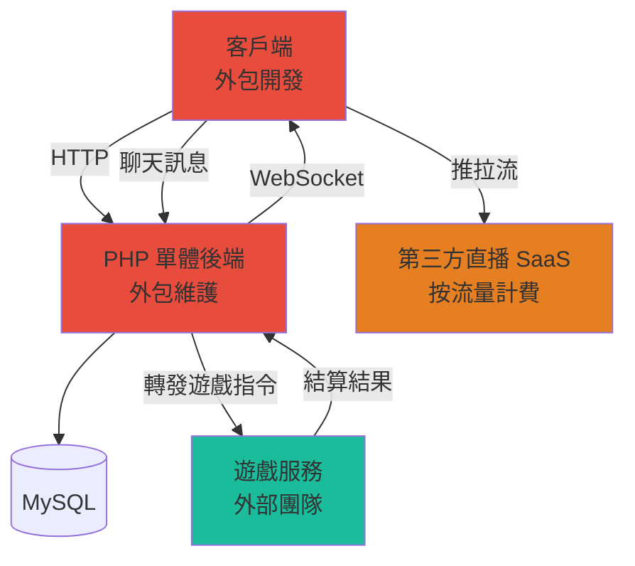
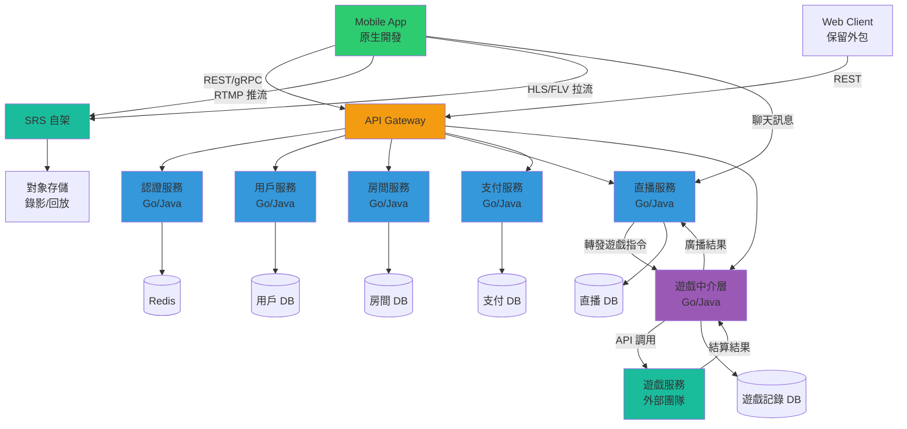
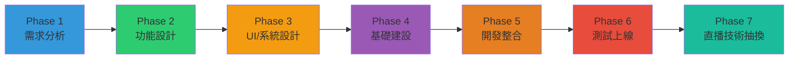
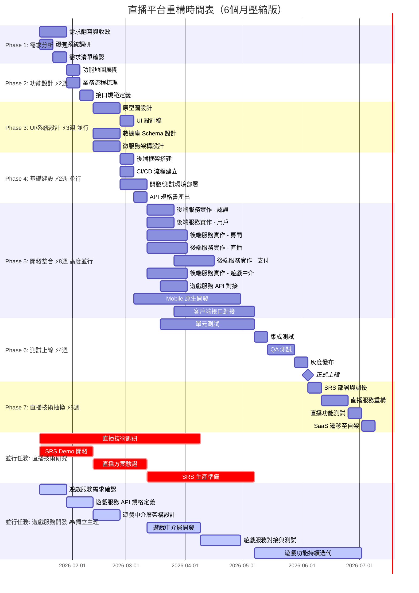
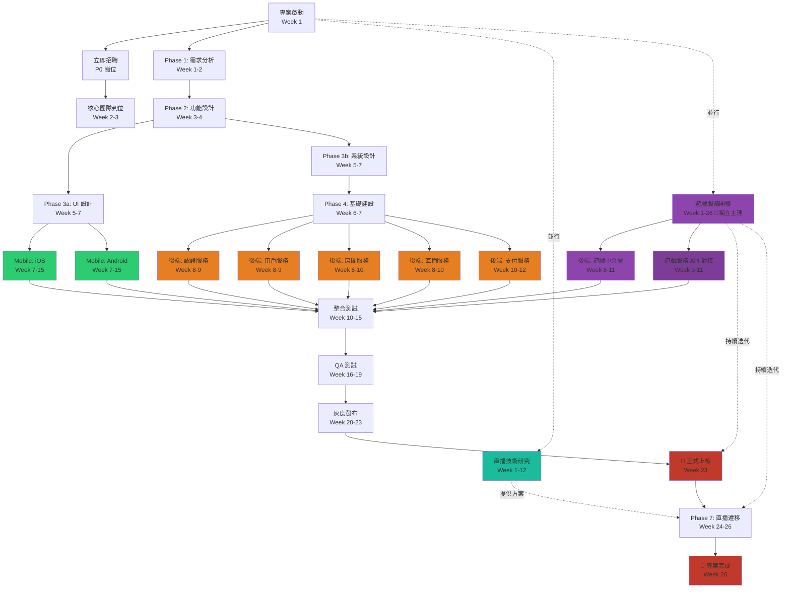

# 直播平台自架開發計畫書

> **版本**: v2.0（6 個月壓縮版）⚡  
> **制定日期**: 2026-01-13  
> **制定人**: 技術長  
> **專案代號**: Live Platform Reconstruction  
> **目標時程**: 6 個月（2026-01-15 至 2026-07-16）

---

## 📊 執行摘要（Executive Summary）

### 🎯 專案目標
在 **6 個月**內完成直播平台從外包 PHP 單體架構遷移至自架微服務架構，包含後端微服務化、Mobile 原生化、以及直播技術自建。

### ⏱️ 時程對比

| 項目 | 原計畫 | 壓縮版 | 壓縮幅度 |
|------|--------|--------|----------|
| **總時程** | 9-10 個月 | **6 個月** | ⚡ -40% |
| **Phase 1-4** | 12 週 | 7 週 | -42% |
| **Phase 5** | 12 週 | 8 週 | -33% |
| **Phase 6** | 6 週 | 4 週 | -33% |
| **Phase 7** | 9 週 | 5 週 | -44% |

### 💰 預算摘要
- **總預算**: $563,000 - $1,050,000（6 個月）
- **團隊規模**: 19-22 人（較原計畫增加 50%）
- **關鍵里程碑**: 2026-06-25 正式上線

### ⚠️ 關鍵成功因素
1. ✅ **Week 1 立即啟動招聘**，P0 崗位必須在 2 週內到位
2. ✅ **Week 2 需求凍結**，之後禁止非緊急需求變更
3. ✅ **最大化並行開發**，5 個後端服務同時進行
4. ✅ **使用成熟方案**，不重新發明輪子
5. ✅ **每週風險評估**，提前識別問題並快速應對

### 🚨 重大風險
1. 🔴 **招聘風險（極高）**: 需在短時間內招到 15+ 優秀工程師
2. 🔴 **時程壓力（極高）**: 壓縮 40% 時間，工作量未減少
3. 🟡 **需求變更（高）**: 需求凍結機制必須嚴格執行
4. 🟡 **質量風險（高）**: 快速開發可能影響代碼質量

### ✅ 建議
- **Option 1（推薦）**: 執行 6 個月計畫，但準備延後 1 個月的備案（實際 7 個月）
- **Option 2（保守）**: 調整為 8 個月，保留更多緩衝時間
- **Option 3（激進）**: 嚴格執行 6 個月，但必須在 Week 1 完成關鍵招聘

---

## 📋 專案概述

### 背景
目前直播平台由外包團隊開發，包含客戶端與後端（PHP），隨著業務擴展與技術演進，需要進行架構重構：

- **後端**: 從單體 PHP 架構拆分為微服務架構（Go/Java）
- **Mobile**: 從外包方案轉為原生開發團隊重構
- **直播技術**: 從第三方 SaaS 轉為自架 SRS 方案

### 目標
1. **業務穩定性**: 確保重構過程不影響現有業務運作
2. **技術升級**: 採用微服務架構提升系統可擴展性
3. **成本優化**: 自架直播服務降低長期運營成本
4. **團隊內化**: 建立內部技術團隊掌握核心技術

### 範圍
- ✅ 後端業務邏輯微服務化
- ✅ Mobile 原生化重構
- ✅ 直播技術棧自建
- ✅ **遊戲服務開發與對接**（獨立主理，持續迭代）
- ⚠️ 暫不處理：Web 端重構、PHP 舊系統完全下線

---

## 🎯 核心架構演進

### 現況 (As-Is)

**現況說明**:
- 客戶端與後端由外包團隊開發維護（PHP 單體架構）
- 直播使用第三方 SaaS 服務（按流量計費）
- **遊戲功能**: 直播間內透過聊天室發送訊息參與遊戲
- **遊戲服務**: 由外部團隊提供，負責遊戲邏輯處理與結算
- 後端 PHP 服務作為中介，轉發遊戲指令並廣播結算結果

### 目標 (To-Be)

**目標架構說明**:
- 微服務化後端（認證、用戶、房間、直播、支付、遊戲中介）
- **遊戲中介層**: 統一對接外部遊戲服務，處理遊戲指令轉發與結果廣播
- **遊戲服務**: 繼續由外部團隊提供，透過 API 對接
- **遊戲參與方式**: 觀眾透過直播間聊天室發送訊息參與遊戲
- **結算流程**: 遊戲服務處理結算後，結果透過遊戲中介層廣播至直播間

---

## 📅 開發階段規劃

### 階段總覽

---

## 📊 甘特圖 (Gantt Chart)

### ⏱️ 時間估算（壓縮版）
- **總週期**: 6 個月（26 週）⚡ 高強度執行
- **Phase 1-4**: 7 週（快速準備階段）
- **Phase 5**: 8 週（核心開發階段 - 增加人力）
- **Phase 6**: 4 週（測試上線階段 - 並行測試）
- **Phase 7**: 5 週（直播技術遷移 - 簡化遷移）
- **遊戲服務開發**: 26 週（獨立主理，貫穿整個專案）💜
- **直播技術研究**: 12 週（並行研究，Week 1-12）
- **策略**: 最大化並行 + 增加人力 + 減少緩衝時間 + 獨立主理遊戲服務

---

## 📝 各階段詳細說明

### Phase 1: 需求分析（2 週）⚡ 壓縮版

#### 目標
快速梳理現有平台功能，產出清晰的需求文檔

#### ⚠️ PHP 代碼分析（Week 1 立即啟動）🔥
- **資深 PHP 工程師到位**：Week 1 必須到位
- **代碼審查與瓶頸分析**：分析現有 PHP 代碼，識別性能瓶頸
- **優先抽換模組識別**：確定哪些模組/服務需要優先抽換
- **分析報告產出**：Week 2 產出分析報告，指導後續開發優先級

#### ⚠️ 遊戲服務獨立啟動
- **遊戲服務需求確認**（Week 1-2）：與遊戲服務團隊確認需求與 API 規格
- **遊戲服務作為獨立主理項目**：從 Week 1 開始獨立規劃與開發
- **遊戲服務團隊到位**：Tech Lead + Go/Java/C# + Unity 工程師 Week 1-3 到位

#### 主要工作（並行執行）
1. **需求翻寫與收斂**（2 週）
   - 集中式工作坊（2-3 天密集訪談）
   - 與產品、外包團隊集中訪談
   - 快速識別核心功能與次要功能
   - 確認 MVP 功能範圍

2. **現有系統調研**（1 週，並行）⚡
   - **PHP 代碼深度審查**（資深 PHP 工程師主導）
   - **性能瓶頸分析**（識別慢查詢、高 CPU、高內存使用）
   - **優先抽換模組識別**（基於瓶頸分析結果）
   - 數據庫結構分析
   - 第三方服務依賴盤點（含遊戲服務 API 規格）
   - **遊戲服務對接方式調研**（與遊戲服務團隊確認現有 API）

3. **需求清單確認**（1 週）
   - 產出精簡版功能需求文檔（FRD）
   - 產出非功能需求（NFR）
   - 快速評審與簽字

#### 交付物
- ✅ 功能需求文檔（FRD）- 精簡版（含遊戲參與功能）
- ✅ 非功能需求文檔（NFR）
- ✅ **PHP 代碼瓶頸分析報告**（資深 PHP 工程師產出）
- ✅ **優先抽換模組清單**（基於瓶頸分析）
- ✅ 現有系統分析報告（含遊戲服務對接現況）
- ✅ 第三方服務清單（含遊戲服務 API 規格）

#### 負責人
- **主導**: 技術長 + 產品經理（全職投入）
- **協助**: 外包團隊技術對接人

#### 壓縮策略
- ✅ 採用工作坊模式，集中 2-3 天完成主要訪談
- ✅ 聚焦核心功能，次要功能後續迭代
- ✅ 系統調研與需求收集並行進行

---

### Phase 2: 功能設計（2 週）⚡ 壓縮版

#### 目標
快速將需求轉化為可實施的功能地圖與流程設計

#### ⚠️ 遊戲服務 API 規格定義
- **遊戲服務 API 規格定義**（Week 3-4）：與外部團隊確認完整的 API 規格文檔
- **遊戲中介層架構設計準備**：基於 API 規格開始設計中介層架構

#### 主要工作（並行執行）
1. **功能地圖展開**（1 週）
   - 按業務領域劃分模組
   - 定義模組間依賴關係
   - 確認微服務邊界（5 個核心服務）

2. **業務流程梳理**（1 週，並行）⚡
   - 繪製核心流程圖（聚焦關鍵路徑）
   - 定義異常流程處理
   - 確認數據流轉路徑

3. **接口規範定義**（1 週）
   - 使用現成的 RESTful API 設計規範
   - 認證授權機制（JWT）
   - 錯誤碼體系定義（參考業界標準）
   - WebSocket 通訊協議
   - **遊戲服務 API 規格確認**（與外部團隊協調）

#### 交付物
- ✅ 功能地圖（按微服務劃分）
- ✅ 核心業務流程圖（含遊戲參與流程）
- ✅ 接口規範文檔（基於模板，含遊戲服務 API）
- ✅ 數據模型初稿

#### 負責人
- **主導**: 技術長 + 後端 Tech Lead（需盡快到位）
- **協助**: 產品經理

#### 壓縮策略
- ✅ 使用業界標準模板，不重新發明輪子
- ✅ 功能地圖與流程梳理並行進行
- ✅ 聚焦核心流程，次要流程後續補充

---

### Phase 3: UI/系統設計（3 週）⚡ 高度並行

#### 目標
快速完成用戶界面與底層系統架構設計

#### ⚠️ 遊戲中介層架構設計
- **遊戲中介層架構設計**（Week 5-6）：完成遊戲中介層的詳細架構設計
- **遊戲服務 Mock 準備**：基於 API 規格準備 Mock 服務，支援前後端並行開發

#### 主要工作（完全並行）
1. **原型圖設計**（2 週）⚡
   - 使用現成 UI 組件庫
   - Wireframe 快速繪製
   - 核心交互流程設計

2. **UI 設計稿**（1 週）⚡
   - 基於成熟設計系統（Material/iOS Human Interface）
   - 視覺設計稿產出
   - 設計規範制定

3. **數據庫 Schema 設計**（2 週，完全並行）⚡
   - 按微服務設計數據庫
   - ER 圖繪製
   - 索引策略（避免過早優化）
   - 簡化遷移方案

4. **微服務架構設計**（2 週，完全並行）⚡
   - 服務拆分方案（5 個核心服務）
   - 服務間通訊機制（優先 REST）
   - 使用成熟的服務發現方案（K8s/Consul）
   - 監控與日誌方案（Prometheus + Grafana + ELK）

#### 交付物
- ✅ 原型圖（基於組件庫）
- ✅ UI 設計稿（基於設計系統）
- ✅ 數據庫 Schema 文檔
- ✅ 微服務架構設計文檔
- ✅ 技術選型報告（基於成熟方案）

#### 負責人
- **UI/UX**: 設計團隊（外包，需立即啟動）
- **系統設計**: 技術長 + 後端 Tech Lead + 後端工程師（需 2-3 人到位）

#### 並行說明
- ✅ UI 設計與後端架構設計**完全並行**進行
- ✅ UI 完成後 Mobile 團隊立即開始開發
- ✅ Schema 完成後立即進入 Phase 4

#### 壓縮策略
- ✅ 使用成熟 UI 組件庫（React Native/Flutter 組件）
- ✅ 採用業界標準架構模式，減少設計時間
- ✅ 避免過早優化，聚焦核心功能

---

### Phase 4: 基礎建設（2 週）⚡ 高度並行

#### 目標
快速搭建開發環境與基礎框架，讓開發團隊可以立即開始編碼

#### 主要工作（並行執行）
1. **後端框架搭建**（1 週）⚡
   - 選定技術棧（Go Gin，決策快速）
   - 使用現成微服務腳手架模板
   - 集成數據庫連接池
   - 集成 Redis

2. **CI/CD 流程建立**（1 週，並行）⚡
   - 採用標準 Git Flow
   - 使用 Docker Compose（開發）+ K8s（生產）
   - GitHub Actions / GitLab CI 自動化
   - 自動化部署腳本

3. **開發/測試環境部署**（2 週，並行）⚡
   - 使用雲服務託管 K8s（AWS EKS/GCP GKE）
   - 快速配置開發環境
   - 快速配置測試環境
   - 監控系統快速部署（使用雲服務整合方案）

4. **API 規格書產出**（1 週）⚡
   - 使用 Swagger/OpenAPI 自動生成
   - 產出核心接口文檔
   - 使用 Postman Mock Server

#### 交付物
- ✅ 後端框架代碼倉庫（基於模板）
- ✅ CI/CD 流程（基於 GitHub Actions）
- ✅ 環境部署文檔（簡化版）
- ✅ API 規格書（Swagger 自動生成）
- ✅ 開發規範文檔（基於業界標準）

#### 負責人
- **主導**: 後端 Tech Lead（需到位）
- **協助**: DevOps 工程師（外包或兼職）+ 後端工程師

#### 壓縮策略
- ✅ 使用現成微服務腳手架，不從零開始
- ✅ 採用雲服務託管，減少運維複雜度
- ✅ CI/CD 使用 GitHub Actions，開箱即用
- ✅ 所有工作高度並行執行

---

### Phase 5: 開發整合（8 週）⚡ 極度並行 + 增加人力

#### 目標
快速實現所有業務邏輯與客戶端對接

#### ⚠️ 重要說明
- **遊戲服務開發獨立主理**：遊戲服務作為專案的主要組件之一，會大量更新迭代，需要及早規劃並獨立排程
- **遊戲服務開發時程**：Week 1-26（貫穿整個專案），與其他階段並行進行
- **遊戲服務負責人**：遊戲中介層負責工程師 + 外部遊戲團隊技術對接人

#### 主要工作

##### 後端開發（Go，6 個服務完全並行）⚡⚡⚡
1. **認證服務**（2 週）⚡ 由 1 名 Go 工程師負責
   - 註冊/登錄
   - JWT 簽發與驗證
   - 第三方登錄（微信、Apple）
   - 簡化權限管理

2. **用戶服務**（2 週）⚡ 由 1 名 Go 工程師負責
   - 用戶資料管理
   - 個人主頁
   - 關注/粉絲系統（簡化版）

3. **房間服務**（3 週）⚡ 由 1 名 Go 工程師負責
   - 房間創建/銷毀
   - 房間列表/搜索
   - 觀眾管理

4. **直播服務**（3 週）⚡ 由 1-2 名 Go 工程師負責
   - 推流地址生成
   - 拉流地址生成
   - 直播狀態管理
   - WebSocket 聊天室
   - 禮物系統（簡化版）
   - **遊戲指令識別與轉發**（與遊戲中介層對接）

5. **支付服務**（3 週）⚡ 由 1 名 Go 工程師負責
   - 充值流程
   - 支付寶/微信支付對接（使用 SDK）
   - 訂單管理
   - 錢包系統

6. **遊戲中介層**（3 週）⚡ 由 1 名 Go 工程師負責（獨立主理）
   - 遊戲指令接收與轉發（從直播服務）
   - 遊戲服務 API 對接（Go/Java/C#）
   - 遊戲結算結果處理
   - 遊戲結果廣播（透過直播服務 WebSocket）
   - 遊戲記錄存儲

**後端團隊配置**: 6-7 名 Go 工程師同時開發

##### 遊戲服務開發（獨立團隊，Go/Java/C# + Unity）💜
**遊戲服務 Tech Lead**（1 名）
- 遊戲服務架構設計
- 技術選型（Go/Java/C#）
- 代碼審查

**遊戲服務後端工程師**（2-4 名）
- Go 工程師（1-2 名）：遊戲服務後端開發
- Java/C# 工程師（1-2 名）：遊戲服務後端開發
- 遊戲邏輯實現
- API 開發與對接

**Unity 工程師**（2-3 名）
- 遊戲前端開發
- 遊戲 UI/UX 實現
- 遊戲邏輯實現
- 與後端 API 對接

**遊戲服務團隊配置**: 6-8 名工程師（獨立主理，Week 1-26）

##### 客戶端開發（原生 iOS/Android，8 週）⚡ 增加人力
**iOS 團隊（3-4 名，原生開發）** ⚡
- Team Lead × 1（Swift/Objective-C）
- 工程師 × 2-3（Swift/Objective-C）
- 週 1: 環境搭建與框架選型（原生開發）
- 週 2-3: 基礎頁面（登錄、首頁、個人中心）
- 週 4-6: 直播功能（推流、拉流、聊天、遊戲參與）
- 週 7-8: 支付與完善

**Android 團隊（3-4 名，原生開發）** ⚡
- Team Lead × 1（Kotlin/Java）
- 工程師 × 2-3（Kotlin/Java）
- 週 1: 環境搭建與框架選型（原生開發）
- 週 2-3: 基礎頁面（登錄、首頁、個人中心）
- 週 4-6: 直播功能（推流、拉流、聊天、遊戲參與）
- 週 7-8: 支付與完善

##### 客戶端接口對接（6 週）⚡ 壓縮時間
- 週 1-2: 認證與用戶模組對接（使用 Mock）
- 週 3-4: 房間與列表對接
- 週 5-6: 直播、聊天、支付、遊戲對接

#### 交付物
- ✅ 6 個微服務完整代碼（含遊戲中介層）
- ✅ iOS App Alpha 版本（含遊戲參與功能）
- ✅ Android App Alpha 版本（含遊戲參與功能）
- ✅ 接口對接測試報告
- ✅ 遊戲服務 API 對接文檔

#### 負責人
- **後端**: Tech Lead + 6-7 名工程師（每人負責 1 個服務）
- **Mobile**: iOS Team Lead + 2 名 iOS 工程師，Android Team Lead + 2 名 Android 工程師
- **遊戲對接**: 遊戲中介層負責工程師 + 外部遊戲團隊技術對接人
- **協調**: 技術長 + 專案經理

#### 並行說明
- ✅ **6 個後端服務完全並行開發**（含遊戲中介層）
- ✅ **💜 遊戲服務開發獨立主理**（Week 1-26，貫穿整個專案）💜
- ✅ **iOS 和 Android 完全並行開發**
- ✅ **後端與 Mobile 同步進行**
- ✅ **遊戲中介層與外部遊戲團隊並行對接**（Week 9-11，需提前確認 API 規格）
- ✅ 前 2 週使用 Mock Server（含遊戲服務 Mock），後端服務陸續交付

#### 壓縮策略
- ✅ **增加人力**: 後端 5-6 人，Mobile 4-6 人
- ✅ **每個服務由專人負責**，減少溝通成本
- ✅ **簡化非核心功能**，後續迭代
- ✅ **使用成熟 SDK 和組件**，不重新造輪子
- ✅ **提前準備 Mock Server**，前後端真正並行

---

### Phase 6: 測試上線（4 週）⚡ 並行測試

#### 目標
快速確保系統穩定性與可用性，完成正式上線

#### 主要工作
1. **單元測試**（貫穿開發階段，持續 7 週）⚡
   - 代碼覆蓋率 > 60%（調整標準）
   - 關鍵業務邏輯 100% 覆蓋
   - 開發時同步寫測試

2. **集成測試**（1 週）⚡
   - 服務間調用測試（自動化）
   - 端到端流程測試
   - 性能測試（快速壓測）

3. **QA 測試**（2 週）⚡ 部分與集成測試並行
   - 功能測試（核心流程優先）
   - 兼容性測試（iOS/Android 主流版本）
   - 安全測試（基礎檢查）
   - 快速 Bug 修復

4. **灰度發布**（1 週）⚡ 壓縮灰度時間
   - 5% → 20% → 50% → 100%（每 2 天擴大一次）
   - 實時監控關鍵指標
   - 快速回滾機制

#### 交付物
- ✅ 測試報告
- ✅ 性能測試報告（簡化版）
- ✅ 上線檢查清單
- ✅ 回滾預案
- ✅ **正式上線**（Week 23）

#### 負責人
- **測試**: QA 團隊（2-3 名，需到位）
- **發布**: DevOps + 技術長

#### 壓縮策略
- ✅ **測試左移**: 開發階段就開始單元測試
- ✅ **自動化測試**: 集成測試完全自動化
- ✅ **並行測試**: 集成測試與 QA 測試部分重疊
- ✅ **快速灰度**: 縮短每個灰度階段時間
- ✅ **聚焦核心**: 優先測試核心業務流程

---

### Phase 7: 直播技術抽換（5 週）🔥 快速遷移

#### 目標
快速從第三方直播 SaaS 遷移至自架 SRS 方案

#### 主要工作（並行執行）
1. **SRS 部署與調優**（1 週）⚡
   - SRS 集群快速部署（使用 Docker/K8s）
   - 負載均衡配置（使用 Nginx/雲服務）
   - 快速性能調優與壓測
   - CDN 暫緩（第二階段優化）

2. **直播服務重構**（2 週）⚡ 部分與部署並行
   - RTMP 推流接口（基於 SRS API）
   - HLS/FLV 拉流接口
   - SRS 回調處理（on_publish, on_unpublish）
   - 錄製功能（基礎版）

3. **直播功能測試**（1 週）⚡
   - 推拉流穩定性測試（快速驗證）
   - 延遲測試
   - 並發測試（模擬真實場景）
   - 異常恢復測試

4. **SaaS 遷移至自架**（1 週）⚡
   - 快速灰度切換（10% → 50% → 100%）
   - 實時監控對比
   - 保留 SaaS 作為備用（1-2 週觀察期）

#### 交付物
- ✅ SRS 部署文檔
- ✅ 直播服務代碼
- ✅ 快速遷移方案
- ✅ 測試報告（簡化版）
- ✅ **完全自架直播系統**（Week 26）

#### 負責人
- **主導**: 技術長（此階段需全職投入）
- **協助**: 直播服務負責工程師 + DevOps

#### 並行說明
- ✅ SRS 部署與服務重構部分並行
- ✅ 測試在開發過程中持續進行
- ✅ 利用 Phase 1-6 期間的技術研究成果

#### 注意事項
- ✅ 此階段在正式上線後進行，不影響核心業務
- ✅ 保留 SaaS 備用方案，確保可快速回滾
- ✅ 重點監控直播質量指標（延遲、卡頓率、成功率）

#### 壓縮策略
- ✅ **前期技術研究充分**: Phase 1-6 期間已完成技術驗證
- ✅ **使用 Demo 經驗**: 本專案的 SRS Demo 可直接參考
- ✅ **暫緩 CDN**: 第一階段先自架，第二階段再優化 CDN
- ✅ **快速灰度**: 縮短每個灰度階段，但保留快速回滾能力

---

## 🎮 遊戲服務獨立開發計劃（獨立主理）💜

### 概述
遊戲服務作為專案的主要組件之一，會大量更新迭代，需要及早規劃並獨立排程。遊戲服務開發貫穿整個專案週期（Week 1-26），與其他開發階段並行進行。

### 開發時程（26 週，貫穿整個專案）

#### Week 1-2: 遊戲服務需求確認 ⚡
**目標**: 與外部遊戲團隊確認需求與 API 規格

**主要工作**:
- 與外部遊戲團隊技術對接人建立溝通機制
- 確認現有遊戲服務 API 規格
- 確認遊戲參與流程（透過聊天室訊息）
- 確認遊戲結算機制
- 產出遊戲服務需求文檔

**交付物**:
- ✅ 遊戲服務需求文檔
- ✅ 現有 API 規格清單
- ✅ 外部團隊對接人聯繫方式

**負責人**: 遊戲中介層負責工程師（需 Week 1 到位）+ 外部遊戲團隊技術對接人

---

#### Week 3-4: 遊戲服務 API 規格定義 ⚡
**目標**: 與外部團隊確認完整的 API 規格文檔

**主要工作**:
- 詳細定義遊戲指令 API（接收、處理、回應）
- 詳細定義遊戲結算 API（結果回傳格式）
- 定義錯誤處理機制
- 定義認證授權機制
- 產出完整的 API 規格文檔（Swagger/OpenAPI）

**交付物**:
- ✅ 遊戲服務 API 規格文檔（Swagger）
- ✅ API Mock Server 準備
- ✅ 錯誤碼定義

**負責人**: 遊戲中介層負責工程師 + 外部遊戲團隊技術對接人

---

#### Week 5-6: 遊戲中介層架構設計 ⚡
**目標**: 完成遊戲中介層的詳細架構設計

**主要工作**:
- 設計遊戲中介層微服務架構
- 設計遊戲指令接收與轉發機制
- 設計遊戲結算結果處理與廣播機制
- 設計遊戲記錄存儲方案
- 設計與直播服務的對接方式（WebSocket）
- 產出架構設計文檔

**交付物**:
- ✅ 遊戲中介層架構設計文檔
- ✅ 數據庫 Schema 設計
- ✅ 與直播服務對接協議文檔

**負責人**: 後端 Tech Lead + 遊戲中介層負責工程師

---

#### Week 7: 遊戲服務 Mock 準備 ⚡
**目標**: 基於 API 規格準備 Mock 服務，支援前後端並行開發

**主要工作**:
- 搭建遊戲服務 Mock Server
- 實現所有 API 端點的 Mock 回應
- 準備測試數據
- 整合到開發環境

**交付物**:
- ✅ 遊戲服務 Mock Server
- ✅ Mock 測試數據
- ✅ Mock Server 使用文檔

**負責人**: 遊戲中介層負責工程師

---

#### Week 8-11: 遊戲中介層開發 ⚡
**目標**: 完成遊戲中介層核心功能開發

**主要工作**:
- 實現遊戲指令接收與轉發
- 實現外部遊戲服務 API 調用
- 實現遊戲結算結果處理
- 實現遊戲結果廣播（透過直播服務 WebSocket）
- 實現遊戲記錄存儲
- 單元測試（覆蓋率 > 70%）

**交付物**:
- ✅ 遊戲中介層完整代碼
- ✅ 單元測試代碼
- ✅ API 文檔

**負責人**: 遊戲中介層負責工程師（1 名，專職）

---

#### Week 9-11: 遊戲服務 API 對接 ⚡（與開發並行）
**目標**: 與外部遊戲團隊完成 API 對接

**主要工作**:
- 與外部團隊協調對接時程
- 測試 API 連接與認證
- 測試遊戲指令發送與接收
- 測試遊戲結算結果回傳
- 處理對接過程中的問題
- 產出對接測試報告

**交付物**:
- ✅ API 對接測試報告
- ✅ 對接問題清單與解決方案
- ✅ 生產環境配置文檔

**負責人**: 遊戲中介層負責工程師 + 外部遊戲團隊技術對接人

---

#### Week 12-15: 遊戲功能整合測試 ⚡
**目標**: 完成遊戲功能與其他服務的整合測試

**主要工作**:
- 遊戲中介層與直播服務整合測試
- 遊戲指令識別與轉發測試
- 遊戲結果廣播測試
- 端到端流程測試（觀眾發送訊息 → 遊戲處理 → 結果廣播）
- 性能測試（並發遊戲參與）
- 異常場景測試

**交付物**:
- ✅ 整合測試報告
- ✅ 性能測試報告
- ✅ Bug 清單與修復記錄

**負責人**: 遊戲中介層負責工程師 + QA 團隊

---

#### Week 16-26: 遊戲功能持續迭代 💜
**目標**: 根據用戶反饋與業務需求持續更新遊戲功能

**主要工作**:
- 收集用戶反饋與業務需求
- 規劃遊戲功能迭代（新遊戲類型、功能優化）
- 持續開發與測試
- 持續優化性能與穩定性
- 與外部團隊協調新功能對接

**交付物**:
- ✅ 每週迭代計劃
- ✅ 功能更新文檔
- ✅ 持續優化的代碼

**負責人**: 遊戲中介層負責工程師 + 外部遊戲團隊

**重要**: 遊戲服務作為獨立主理項目，持續迭代不影響主線開發

---

### 遊戲服務開發特點

#### 1. 獨立主理
- **獨立排程**: 遊戲服務開發有獨立的時程規劃，不依賴其他服務
- **獨立負責人**: 專職的遊戲中介層負責工程師
- **獨立迭代**: 可以獨立進行功能迭代，不影響主線開發

#### 2. 並行開發
- **與主線並行**: 遊戲服務開發與其他服務開發完全並行
- **前後端並行**: 使用 Mock Server 實現前後端並行開發
- **持續迭代**: 貫穿整個專案週期，持續迭代更新

#### 3. 外部協作
- **外部團隊**: 與外部遊戲團隊密切協作
- **API 對接**: 需要與外部團隊協調 API 規格與對接時程
- **溝通機制**: 建立定期溝通機制（每週對接會議）

---

### 關鍵成功因素

1. ✅ **Week 1 立即啟動**: 遊戲服務需求確認必須在 Week 1 開始
2. ✅ **API 規格提前確認**: Week 3-4 必須完成 API 規格定義
3. ✅ **Mock Server 準備**: Week 7 必須完成 Mock Server，支援並行開發
4. ✅ **專職負責人**: 遊戲中介層必須有專職工程師負責
5. ✅ **持續溝通**: 與外部團隊建立定期溝通機制
6. ✅ **獨立迭代**: 遊戲功能可以獨立迭代，不阻塞主線

---

### 風險與應對

| 風險 | 可能性 | 影響 | 緩解措施 |
|------|--------|------|----------|
| **外部團隊 API 規格延遲** | 高 | 高 | Week 1 立即啟動溝通，Week 3 前必須確認 |
| **外部團隊對接延遲** | 中 | 高 | 使用 Mock Server 繼續開發，對接完成後切換 |
| **遊戲功能需求變更** | 高 | 中 | 獨立迭代機制，不影響主線開發 |
| **遊戲中介層開發延遲** | 中 | 中 | 專職負責人，優先級管理 |

---

## 👥 團隊與資源配置

### 核心團隊（6 個月壓縮版 - Go 後端 + 原生客戶端 + PHP 分析 + 遊戲服務）

#### 📊 人力配置總表

| 團隊 | 角色 | 人數 | 技術棧 | 職責 | 招聘/現有 | 優先級 | 到位時間 |
|------|------|------|--------|------|----------|--------|----------|
| **管理層** | 技術長 | 1 | - | 整體架構設計、直播技術研究、團隊管理 | ✅ 現有 | - | Week 1 |
| | 產品經理 | 1 | - | 需求管理、優先級排序 | ✅ 現有 | - | Week 1 |
| | 專案經理 | 1 | - | 協調、進度追蹤、風險管理 | 🔍 待招聘 | P1 | Week 2 |
| **PHP 分析團隊** | **資深 PHP 工程師** | **1-2** | **PHP** | **代碼審查、瓶頸分析、優先抽換模組識別** | 🔍 待招聘 | **P0** | **Week 1** |
| **後端團隊（Go）** | 後端 Tech Lead | 1 | Go | 微服務架構、技術選型、代碼審查 | 🔍 待招聘 | P0 | Week 2 |
| | 後端工程師（Go） | 5 | Go | 認證/用戶/房間/直播/支付服務開發（每人 1 個服務） | 🔍 待招聘 | P0-P1 | Week 3-4 |
| | 遊戲中介層工程師（Go） | 1 | Go | 💜 遊戲中介層開發（Week 1-26，獨立主理） | 🔍 待招聘 | P0 | Week 1 |
| **遊戲服務團隊** | **遊戲服務 Tech Lead** | **1** | **Go/Java/C#** | **遊戲服務架構設計、技術選型** | 🔍 待招聘 | **P0** | **Week 1** |
| | **遊戲服務工程師（Go）** | **1-2** | **Go** | **遊戲服務後端開發** | 🔍 待招聘 | **P0** | **Week 2-3** |
| | **遊戲服務工程師（Java/C#）** | **1-2** | **Java/C#** | **遊戲服務後端開發** | 🔍 待招聘 | **P0** | **Week 2-3** |
| | **Unity 工程師** | **2-3** | **Unity/C#** | **遊戲前端開發、遊戲邏輯實現** | 🔍 待招聘 | **P0** | **Week 2-3** |
| **客戶端團隊（原生）** | iOS Team Lead | 1 | Swift/Objective-C | iOS 架構設計、代碼審查 | 🔍 待招聘 | P0 | Week 2 |
| | iOS 工程師 | 2-3 | Swift/Objective-C | iOS 原生開發 | 🔍 待招聘 | P1 | Week 3-4 |
| | Android Team Lead | 1 | Kotlin/Java | Android 架構設計、代碼審查 | 🔍 待招聘 | P0 | Week 2 |
| | Android 工程師 | 2-3 | Kotlin/Java | Android 原生開發 | 🔍 待招聘 | P1 | Week 3-4 |
| **基礎設施團隊** | DevOps 工程師 | 1-2 | Docker/K8s | CI/CD、環境部署、監控 | 🔍 待招聘或外包 | P1 | Week 3 |
| | QA 工程師 | 2-3 | - | 測試計畫、自動化測試、執行測試 | 🔍 待招聘或外包 | P2 | Week 4-5 |
| **設計團隊** | UI/UX 設計師 | 1-2 | Figma/Sketch | 原型圖、UI 設計 | 🔍 外包 | P0 | Week 1 |

**總人數**: **28-35 人**（含 PHP 分析團隊 + 遊戲服務團隊）

**備註**: 
- PHP 分析團隊：Week 1 立即到位，負責分析現有 PHP 代碼，識別瓶頸與優先抽換模組
- 遊戲服務團隊：獨立主理，Week 1-26 持續開發
- 後端明確使用 Go，客戶端明確使用原生 iOS/Android

### 資源需求（6 個月壓縮版 - 更新版）

#### 人力成本（月）

| 團隊 | 人數 | 月薪範圍 | 月成本 | 說明 |
|------|------|----------|--------|------|
| **管理層** | 2-3 | $5,000-10,000 | $10,000-30,000 | 技術長（現有）+ 產品經理（現有）+ 專案經理 |
| **PHP 分析團隊** | **1-2** | **$6,000-10,000** | **$6,000-20,000** | **資深 PHP 工程師，瓶頸分析** |
| **後端團隊（Go）** | 7 | $5,000-8,000 | $35,000-56,000 | Tech Lead × 1 + 工程師 × 5 + 遊戲中介層 × 1 |
| **遊戲服務團隊** | **6-8** | **$5,000-9,000** | **$30,000-72,000** | **Tech Lead × 1 + Go/Java/C# × 2-4 + Unity × 2-3** |
| **客戶端團隊（原生）** | 6-8 | $5,000-8,000 | $30,000-64,000 | iOS Team Lead × 1 + iOS × 2-3 + Android Team Lead × 1 + Android × 2-3 |
| **基礎設施團隊** | 3-5 | $4,000-6,000 | $12,000-30,000 | DevOps × 1-2 + QA × 2-3 |
| **設計團隊** | 1-2 | $3,000-5,000 | $3,000-10,000 | UI/UX（外包） |
| **月成本總計** | **28-35 人** | - | **$126,000-282,000** | - |
| **6 個月總成本** | - | - | **$756,000-1,692,000** | - |

**成本說明**:
- PHP 分析團隊：資深工程師，薪資較高
- 遊戲服務團隊：Unity 工程師薪資較高（$6,000-9,000）
- 原生客戶端：iOS/Android 工程師薪資較高
- 成本範圍取決於經驗水平與地區

#### 基礎設施成本（月）
- 開發/測試環境: $800-1,500（增加規模）
- 監控與日誌: $300-600
- CI/CD 工具: $200-500
- **月成本估算**: $1,300-2,600
- **6 個月總成本**: $7,800-15,600

#### 第三方服務（月）
- 對象存儲: $200-800
- CDN（可選）: $500-2,000
- 其他 SaaS 工具: $300-700
- 外包服務（UI/QA）: $3,000-8,000
- **月成本估算**: $4,000-11,500
- **6 個月總成本**: $24,000-69,000

#### 💰 總預算估算
- **人力成本**: $480,000-870,000
- **基礎設施**: $7,800-15,600
- **第三方服務**: $24,000-69,000
- **緩衝（10%）**: $51,180-95,460
- **總計**: **$563,000-1,050,000**（6 個月）

### 招聘優先級（壓縮版 - 快速到位 - 更新版）

#### P0（立即招聘 - Week 1）⚡ 關鍵崗位
| 角色 | 人數 | 技術棧 | 關鍵性 | 到位時間 |
|------|------|--------|--------|----------|
| **資深 PHP 工程師** | **1-2** | **PHP** | **極高（瓶頸分析）** | **Week 1** |
| 後端 Tech Lead | 1 | Go | 極高 | Week 2 |
| **遊戲服務 Tech Lead** | **1** | **Go/Java/C#** | **極高** | **Week 1** |
| **遊戲中介層工程師** | **1** | **Go** | **極高（獨立主理）** | **Week 1** |
| iOS Team Lead | 1 | Swift/Objective-C | 極高 | Week 2 |
| Android Team Lead | 1 | Kotlin/Java | 極高 | Week 2 |
| UI/UX 設計師 | 1 | Figma/Sketch | 極高（外包） | Week 1 |

#### P1（1-2 週內到位）⚡ 核心開發
| 角色 | 人數 | 技術棧 | 到位時間 |
|------|------|--------|----------|
| **遊戲服務工程師（Go）** | **1-2** | **Go** | **Week 2-3** |
| **遊戲服務工程師（Java/C#）** | **1-2** | **Java/C#** | **Week 2-3** |
| **Unity 工程師** | **2-3** | **Unity/C#** | **Week 2-3** |
| 後端工程師（Go） | 3 | Go | Week 3 |
| iOS 工程師 | 2 | Swift/Objective-C | Week 3-4 |
| Android 工程師 | 2 | Kotlin/Java | Week 3-4 |
| DevOps 工程師 | 1 | Docker/K8s | Week 3 |

#### P2（3-4 週內到位）
| 角色 | 人數 | 技術棧 | 到位時間 |
|------|------|--------|----------|
| 後端工程師（Go） | 2 | Go | Week 4 |
| iOS 工程師 | 1 | Swift/Objective-C | Week 4 |
| Android 工程師 | 1 | Kotlin/Java | Week 4 |
| QA 工程師 | 2-3 | - | Week 4-5 |
| 專案經理 | 1 | - | Week 2（或由技術長兼任）|

### 招聘策略
- ✅ **同時招聘**: 所有崗位同時啟動招聘流程
- ✅ **快速面試**: 簡化面試流程，2 輪即決定
- ✅ **外包備選**: 關鍵崗位若招不到，考慮資深外包
- ✅ **遠程工作**: 開放遠程，擴大人才池
- ✅ **競爭薪資**: 提供有競爭力的薪資與股權激勵

---

## ⚠️ 風險管理（6 個月壓縮版 - 風險更高）

### 技術風險

| 風險 | 可能性 | 影響 | 緩解措施 | 應對計畫 |
|------|--------|------|----------|----------|
| **SRS 性能不足** | 中 | 高 | Phase 1-6 持續技術驗證、提前壓測、準備橫向擴展 | 保留 SaaS 備用至少 1 個月 |
| **微服務複雜度** | 高 | 高 | 使用成熟框架、Tech Lead 把關架構、代碼審查 | 必要時簡化服務拆分 |
| **數據遷移失敗** | 中 | 高 | 充分測試、分階段遷移、保留回滾方案、演練多次 | 準備快速回滾腳本 |
| **技術棧不熟悉** | 高 | 高 | 招聘有經驗工程師、提供快速培訓、配對編程 | 外包資深顧問支援 |
| **整合問題** | 高 | 中 | API 規範嚴格、自動化測試、每週集成測試 | 增加集成測試頻率 |
| **性能瓶頸** | 中 | 中 | 提前壓測、預留優化時間、監控關鍵指標 | 優先優化關鍵路徑 |
| **遊戲服務對接延遲** | 中 | 高 | 提前確認 API 規格、與外部團隊建立溝通機制、準備 Mock 方案 | 使用 Mock 服務繼續開發 |

### 人員風險（壓縮版風險更高）

| 風險 | 可能性 | 影響 | 緩解措施 | 應對計畫 |
|------|--------|------|----------|----------|
| **關鍵人員離職** | 中 | 極高 | 簽訂留任協議、知識文檔化、代碼審查、交叉培訓 | 立即啟動招聘遞補 |
| **招聘不順利** | **極高** | 極高 | 同時招聘、擴大渠道（遠程/外包）、競爭薪資、快速面試 | 外包備選方案、延長工時 |
| **團隊磨合問題** | 高 | 高 | 每日站會、明確分工、技術長密切關注、團建活動 | 快速調整人員配置 |
| **工作量過大** | **極高** | 高 | 合理排程、避免 996、提供加班補償、關注團隊健康 | 動態調整功能範圍 |
| **技能不匹配** | 中 | 高 | 嚴格面試、試用期評估、提供培訓 | 快速替換不適任人員 |

### 業務風險

| 風險 | 可能性 | 影響 | 緩解措施 | 應對計畫 |
|------|--------|------|----------|----------|
| **需求頻繁變更** | 高 | 極高 | **需求凍結機制**（Week 2 後禁止變更）、變更委員會 | 變更延後到第二階段 |
| **上線延期** | **極高** | 極高 | 每週進度檢查、提前識別風險、動態調整範圍 | 砍掉非核心功能、延後上線 |
| **用戶體驗下降** | 中 | 高 | 充分測試、UI/UX 專家把關、用戶調研、灰度發布 | 快速回滾、緊急修復 |
| **成本超支** | **極高** | 高 | 每週預算審查、嚴格控制外包、優先級排序 | 削減非核心功能、尋求額外預算 |
| **質量下降** | 高 | 高 | 代碼審查、自動化測試、QA 團隊把關、測試左移 | 增加測試時間、延後上線 |
| **競爭對手動作** | 中 | 中 | 市場監控、快速響應、保持差異化優勢 | 加快上線節奏、動態調整功能 |

### 🚨 關鍵風險點

#### 1. 招聘風險（最高優先級）
- **問題**: 6 個月壓縮版需要快速組建 19-22 人團隊
- **應對**: 
  - Week 1 立即啟動所有招聘流程
  - 同時聯絡外包公司作為 Plan B
  - 提供有競爭力的薪資與股權
  - 開放遠程工作
  
#### 2. 時程壓力（極高風險）
- **問題**: 時間壓縮 40%，工作量未減少
- **應對**:
  - 準備功能優先級清單，隨時砍掉次要功能
  - 每週評估進度，提前 2 週預警
  - 準備延後上線 2-4 週的備案
  
#### 3. 需求變更（必須嚴控）
- **問題**: 需求變更會導致時程崩潰
- **應對**:
  - **Week 2 需求凍結**，任何變更需管理層審批
  - 建立變更委員會，評估影響
  - 非緊急變更延後到第二階段

### 風險監控機制

#### 每週風險評估會議
- **參與**: 技術長、Tech Lead、產品、專案經理
- **評估**: 各項風險狀態、新風險識別
- **決策**: 應對措施調整、資源重新分配

#### 紅黃綠燈制度
- 🟢 **綠燈**: 進度正常，風險可控
- 🟡 **黃燈**: 有延期風險，需要關注
- 🔴 **紅燈**: 嚴重延期，需要升級處理

#### 升級機制
- **黃燈**: Tech Lead 處理，每日更新
- **紅燈**: 技術長介入，管理層知情
- **連續紅燈**: 管理層決策（砍功能/延期/加人力）

---

## 📈 里程碑與檢查點

| 里程碑 | 預計時間 | 檢查標準 | 審批人 | 實際日期 |
|--------|----------|----------|--------|----------|
| **M1: 需求凍結** | Week 2 | FRD 簽字確認 | 管理層 + 產品 | 2026-01-29 |
| **M2: 設計完成** | Week 5 | 原型圖 + Schema + 架構文檔 | 技術長 | 2026-02-19 |
| **M3: 環境就緒** | Week 7 | 開發環境可用、API 文檔產出 | Tech Lead | 2026-03-05 |
| **M4: Alpha 版本** | Week 15 | 核心功能可運行 | 技術長 | 2026-04-30 |
| **M5: Beta 版本** | Week 19 | 所有功能開發完成 | 產品 + 技術長 | 2026-05-28 |
| **M6: 正式上線** | Week 23 | QA 通過、灰度驗證 | 管理層 | 🎯 **2026-06-25** |
| **M7: 直播遷移完成** | Week 26 | SRS 完全替代 SaaS | 技術長 | 🎯 **2026-07-16** |

### 關鍵時間節點
- **專案啟動**: 2026-01-15
- **團隊到位**: 2026-02-05（P0 & P1 團隊）
- **開發啟動**: 2026-03-12
- **Alpha 測試**: 2026-04-30
- **Beta 測試**: 2026-05-28
- **🎯 正式上線**: 2026-06-25（6 個月目標）
- **🎯 直播自架**: 2026-07-16

---

## 📊 成功指標 (KPI)

### 技術指標
- ✅ API 平均響應時間 < 200ms
- ✅ 系統可用性 > 99.9%
- ✅ 直播延遲: HLS < 20s, FLV < 3s
- ✅ 代碼測試覆蓋率 > 70%
- ✅ 部署頻率: 每週至少 1 次

### 業務指標
- ✅ 核心功能完整性 100%
- ✅ 用戶遷移成功率 > 95%
- ✅ 重大 Bug 數量 = 0
- ✅ 直播成本降低 > 40%（vs SaaS）

### 團隊指標
- ✅ 招聘完成率 > 90%
- ✅ 團隊滿意度 > 4.0/5.0
- ✅ 文檔完整性 > 90%

---

## 🔄 並行工作流說明（6 個月壓縮版）

### 極致並行策略（最大化效率）⚡⚡⚡

### 關鍵並行點（6 個月壓縮版）

#### 1️⃣ Phase 1 期間（Week 1-2）
- ✅ 需求分析
- ✅ **立即啟動招聘**（最關鍵，含遊戲中介層負責人）
- ✅ 直播技術研究開始
- ✅ **遊戲服務需求確認開始**（獨立主理）💜

#### 2️⃣ Phase 3 期間（Week 5-7）
- ✅ UI 設計與系統設計**完全並行**
- ✅ 基礎建設可提前開始（Week 6）

#### 3️⃣ Phase 5 期間（Week 8-15）⚡ 最大並行度
- ✅ **6 個後端服務完全並行**開發（6-7 名工程師，含遊戲中介層）
- ✅ **遊戲中介層開發**（Week 8-11，獨立主理）💜
- ✅ **遊戲服務 API 對接**（Week 9-11，與外部團隊協作）💜
- ✅ **iOS 和 Android 完全並行**開發（4-6 名工程師）
- ✅ **後端與 Mobile 同步進行**
- ✅ 前 2 週使用 Mock Server（含遊戲服務 Mock）
- ✅ 單元測試隨開發持續進行

#### 4️⃣ Phase 6 期間（Week 16-23）
- ✅ 整合測試與 QA 測試部分並行
- ✅ 灰度發布與監控同步進行

#### 5️⃣ 整體並行
- ✅ **直播技術研究貫穿 Phase 1-5**（Week 1-15）
- ✅ **遊戲服務開發貫穿整個專案**（Week 1-26，獨立主理）
- ✅ 單元測試貫穿 Phase 5-6（Week 8-19）

### 並行度對比

| 階段 | 原計畫並行度 | 壓縮版並行度 | 提升 |
|------|-------------|-------------|------|
| **Phase 3** | 2 軌並行 | 3 軌並行（UI/系統/基礎建設） | +50% |
| **Phase 5** | 3-4 軌並行 | **13 軌並行**（6 後端 + 遊戲對接 + 2 Mobile + 測試） | +225% |
| **Phase 6** | 序列執行 | 部分並行 | +30% |

### 🎯 並行成功的關鍵
1. ✅ **嚴格的接口規範**: API 規格書必須在 Week 7 完成
2. ✅ **Mock Server**: Week 8 就緒，讓前後端真正並行
3. ✅ **每人負責一個服務**: 減少溝通成本
4. ✅ **每日同步**: 15 分鐘站會解決阻塞
5. ✅ **Tech Lead 協調**: 解決服務間依賴問題
6. ✅ **自動化測試**: 快速驗證整合問題

---

## 📞 溝通機制

### 會議節奏
- **每日站會**: 15 分鐘，同步進度與阻塞
- **週會**: 1 小時,階段性成果展示
- **月度評審**: 2 小時，里程碑檢查
- **技術評審**: 按需召開，重大技術決策

### 文檔管理
- **Confluence/Notion**: 需求、設計文檔
- **Git**: 代碼與技術文檔
- **Swagger**: API 文檔
- **Figma**: UI 設計稿

### 協作工具
- **專案管理**: Jira / Linear
- **溝通**: Slack / Teams
- **代碼**: GitHub / GitLab
- **監控**: Grafana + Sentry

---

## 🎓 知識傳承計畫

### 文檔化要求
- ✅ 架構設計文檔
- ✅ 接口規範文檔
- ✅ 部署運維文檔
- ✅ 故障排查手冊
- ✅ 新人 Onboarding 指南

### 培訓計畫
- **Week 1**: 新人入職培訓（架構、業務、流程）
- **Monthly**: 技術分享會（團隊成員輪流）
- **Quarterly**: 外部培訓或技術大會

---

## 📋 附錄

### A. 技術選型參考
- **後端語言**: Go（推薦）或 Java
- **後端框架**: Gin / Spring Boot
- **數據庫**: PostgreSQL / MySQL
- **緩存**: Redis
- **消息隊列**: RabbitMQ / Kafka
- **直播服務器**: SRS
- **監控**: Prometheus + Grafana
- **日誌**: ELK Stack

### B. 參考資料
- [SRS 官方文檔](https://ossrs.net/)
- [微服務架構設計模式](https://microservices.io/)
- [直播技術架構實踐](https://github.com/ossrs/srs)

### C. 變更記錄
| 日期 | 版本 | 變更內容 | 變更人 |
|------|------|----------|--------|
| 2026-01-13 | v1.0 | 初版發布 | 技術長 |

---

## 🎯 6 個月壓縮版執行要點

### ✅ 必須做到的事（Critical Success Factors）

#### Week 1（專案啟動週）
- [ ] **立即啟動所有招聘流程**（P0 崗位）
- [ ] **資深 PHP 工程師到位**（瓶頸分析）🔥
- [ ] **遊戲服務 Tech Lead 到位**（Go/Java/C#）💜
- [ ] **遊戲中介層工程師到位**（Go）💜
- [ ] 聯絡外包公司作為備選方案
- [ ] 技術長與產品經理全職投入需求分析
- [ ] **啟動直播技術研究**（技術長）
- [ ] **啟動遊戲服務開發**（遊戲服務團隊）💜
- [ ] **啟動 PHP 代碼分析**（資深 PHP 工程師）🔥
- [ ] 確認預算與管理層支持

#### Week 2（需求凍結週）
- [ ] **需求凍結**，產出 FRD 並簽字
- [ ] **PHP 瓶頸分析報告產出**（資深 PHP 工程師）🔥
- [ ] **優先抽換模組清單確認**（基於瓶頸分析）🔥
- [ ] P0 崗位（Tech Lead）到位
- [ ] **遊戲服務工程師到位**（Go/Java/C# + Unity）💜
- [ ] 開始系統架構設計
- [ ] 確定技術棧（**Go 後端** + **原生 iOS/Android** + K8s + 成熟框架）

#### Week 3-4（快速設計）
- [ ] 後端 Tech Lead 完成架構設計
- [ ] P1 工程師開始到位（3-5 人）
- [ ] 功能地圖與接口規範完成
- [ ] UI/UX 外包簽約並啟動
- [ ] **遊戲服務 API 規格定義完成**（與外部團隊確認）💜

#### Week 5-7（設計與建設）
- [ ] UI 設計與系統設計並行完成
- [ ] 開發環境搭建完成
- [ ] API 規格書產出（含遊戲服務 API）
- [ ] Mock Server 就緒（含遊戲服務 Mock）
- [ ] 全體工程師到位（15+ 人）
- [ ] **遊戲中介層架構設計完成**💜

#### Week 8-15（極致並行開發）
- [ ] 6 個後端服務同時開發（含遊戲中介層）
- [ ] **遊戲中介層開發**（Week 8-11）💜
- [ ] **遊戲服務 API 對接**（Week 9-11）💜
- [ ] iOS/Android 同時開發（含遊戲參與功能）
- [ ] 每日站會同步進度
- [ ] 單元測試覆蓋率 > 60%
- [ ] 每週集成測試（含遊戲功能）

#### Week 16-19（測試階段）
- [ ] QA 團隊全力測試
- [ ] 開發團隊快速修復 Bug
- [ ] 性能測試與優化
- [ ] 安全測試

#### Week 20-23（灰度上線）
- [ ] 5% → 20% → 50% → 100% 灰度
- [ ] 實時監控關鍵指標
- [ ] 快速響應問題
- [ ] **Week 23 正式上線** 🎯

#### Week 24-26（直播遷移）
- [ ] SRS 部署與調優
- [ ] 直播服務重構
- [ ] 灰度切換至自架
- [ ] **Week 26 完全自架** 🎯
- [ ] **遊戲服務持續迭代**（獨立主理，不影響主線）💜

---

### ⚠️ 禁止做的事（What NOT to Do）

1. ❌ **不要在 Week 2 後改需求**（除非緊急 Bug）
2. ❌ **不要過度設計**（使用成熟方案，不重新造輪子）
3. ❌ **不要忽視測試**（測試左移，開發時就寫測試）
4. ❌ **不要等人齊再開始**（用 Mock Server 解耦）
5. ❌ **不要默默承受問題**（每日站會暴露阻塞）
6. ❌ **不要犧牲核心質量**（可以砍功能，不能降低穩定性）

---

### 📊 每週檢查清單（Weekly Checklist）

#### 技術長每週必做
- [ ] 週一：檢視上週進度，識別本週風險
- [ ] 週三：與 Tech Lead 1-on-1，解決技術問題
- [ ] 週五：週會展示進度，評估里程碑達成度
- [ ] 每日：參加站會（至少遠程參與）

#### Tech Lead 每週必做
- [ ] 每日站會（15 分鐘）
- [ ] 代碼審查（每天至少 2 小時）
- [ ] 架構決策文檔化
- [ ] 週報產出（進度、風險、下週計畫）

#### 產品經理每週必做
- [ ] 守住需求凍結防線
- [ ] 優先級排序（若需砍功能）
- [ ] 與業務方溝通進度
- [ ] 準備測試案例

---

### 🚨 緊急應變計畫

#### 情況 1: 關鍵人員招不到（Week 2）
- **應對**: 啟動外包備選方案
- **決策人**: 技術長
- **時限**: Week 3 前必須解決

#### 情況 2: 進度落後 > 2 週（任何階段）
- **應對**: 啟動紅燈升級機制
- **決策**: 管理層會議決定（砍功能/延期/加人力）
- **時限**: 3 天內做出決策

#### 情況 3: 核心功能開發遇到技術瓶頸
- **應對**: 技術長親自介入或尋求外部專家
- **決策人**: 技術長
- **時限**: 1 週內解決或改方案

#### 情況 4: 測試發現重大 Bug（Week 16+）
- **應對**: 延後上線 1-2 週，全力修復
- **決策人**: 技術長 + 管理層
- **底線**: 不帶重大 Bug 上線

---

### 💡 成功案例借鏡

參考業界類似專案的經驗：
- **Spotify**: 微服務改造用了 2 年，但採用漸進式遷移
- **Netflix**: 用了 7 年完成雲端遷移，但業務持續運行
- **Airbnb**: Mobile 重構用了 1 年，但分階段發布

**我們的策略**:
- ✅ 用 6 個月完成 MVP（最小可行產品）
- ✅ 非核心功能延後到第二階段（Month 7-12）
- ✅ 保持舊系統並行運行 3 個月作為備用

---

### 📈 第二階段規劃（Month 7-12）

如果 6 個月計畫成功執行，建議的第二階段優化：

1. **功能完善**（Month 7-9）
   - 補充 Phase 1 砍掉的次要功能
   - 用戶反饋驅動的優化
   - 更多第三方服務整合

2. **性能優化**（Month 9-10）
   - CDN 整合
   - 數據庫優化與分片
   - 緩存策略優化
   - 監控告警完善

3. **運營工具**（Month 10-12）
   - 後台管理系統
   - 數據分析平台
   - 運營自動化工具

4. **遊戲服務持續迭代**（Month 7-12）💜
   - **💜 遊戲服務作為獨立主理項目持續開發**
   - 根據用戶反饋與業務需求持續更新遊戲功能
   - 遊戲中介層優化與擴展
   - 新遊戲類型接入

---

**審核簽字**

- [ ] 技術長: _____________________ 日期: _______
- [ ] 產品負責人: _________________ 日期: _______  
- [ ] 管理層: _____________________ 日期: _______
- [ ] 財務負責人: _________________ 日期: _______

---

**版本歷史**

| 版本 | 日期 | 變更內容 | 變更人 |
|------|------|----------|--------|
| v1.0 | 2026-01-13 | 初版（9-10 個月計畫） | 技術長 |
| v2.0 | 2026-01-13 | 壓縮為 6 個月計畫 | 技術長 |
| v2.1 | 2026-01-13 | 新增遊戲服務架構與開發排程 | 技術長 |
| v2.2 | 2026-01-13 | 遊戲服務獨立主理，獨立排程（類似直播技術研究） | 技術長 |

---

**⚠️ 重要聲明**

*本計畫書為 6 個月壓縮版，執行風險較高。建議在實際執行時：*
1. *準備延後 1 個月的備案（實際 7 個月）*
2. *嚴格執行需求凍結與風險管理機制*
3. *每週評估進度，動態調整功能範圍*
4. *確保團隊健康，避免過度加班導致的質量問題*

*如時程要求不是特別緊急，建議採用 8 個月的穩健計畫。*
