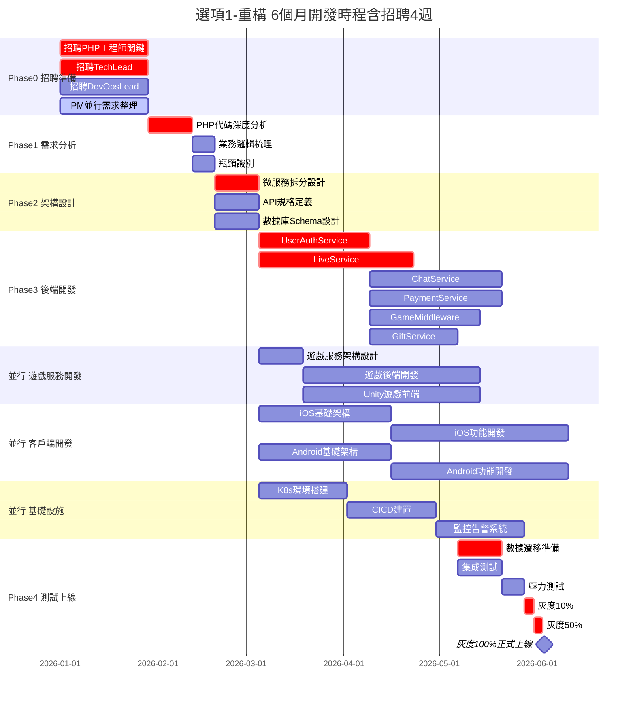
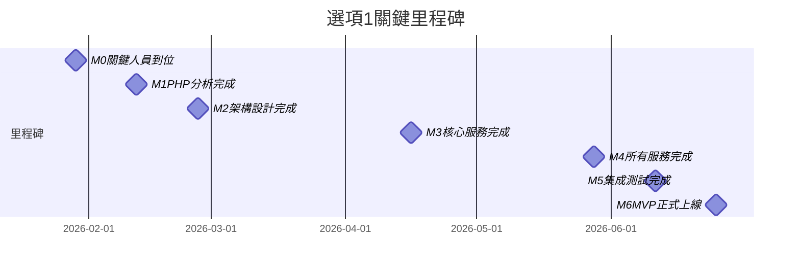
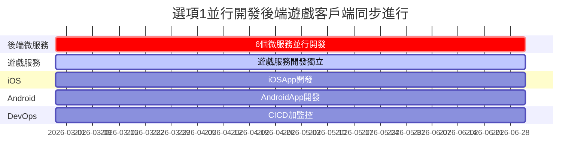

# PK Live 2.0 - 選項1：重構方案

> **版本**: v1.0 | **日期**: 2026-01-13  
> **適用條件**: 有外包代碼，質量可接受

---

## 📋 方案概述

**核心策略**：分析現有 PHP 代碼，識別可重用邏輯，逐步重構為 Go 微服務

**適用條件**：
- ✅ 能拿到外包代碼
- ✅ 代碼質量可接受（50%+）
- ✅ 時間壓力大，需快速上線
- ✅ 業務邏輯清晰

**不適用條件**：
- ❌ 代碼質量太差（<30%）
- ❌ 無法獲取代碼
- ❌ 業務邏輯混亂不堪

---

## 🎯 關鍵優勢

| 優勢 | 說明 |
|------|------|
| **時程最短** | 7.5個月 MVP，11.5-13個月完整版 |
| **成本可控** | 人力需求 20-26 人，相對精簡 |
| **風險較低** | 有現有邏輯可參考，降低重複踩坑 |
| **業務連續** | 快速替換現有系統，最小化業務中斷 |

---

## ⚠️ 關鍵風險

| 風險 | 影響程度 | 緩解措施 |
|------|---------|---------|
| **代碼質量差** | 高 | 招聘資深 PHP 工程師先評估，輸出詳細報告 |
| **隱藏邏輯** | 中 | 詳細文檔化現有邏輯，與業務團隊確認 |
| **依賴複雜** | 中 | 模組化拆分，降低耦合度 |
| **技術債遺留** | 中 | 重構而非照搬，引入最佳實踐 |

---

## 👥 人力配置

### MVP 階段（6個月，實際開發 4.5個月）

| 團隊 | 人數 | 角色 | 優先級 | 關鍵職責 |
|------|------|------|--------|---------|
| **PHP 分析** | 1-2人 | 資深 PHP 工程師 | P0 | 代碼分析、瓶頸識別 |
| **Go 後端** | 6-7人 | Tech Lead + 5-6 工程師 | P0 | 微服務開發 |
| **遊戲服務** | 5-6人 | Tech Lead + 後端 + Unity | P1 | 遊戲功能開發 |
| **iOS** | 1-2人 | Team Lead + 工程師 | P0 | iOS App 開發 |
| **Android** | 1-2人 | Team Lead + 工程師 | P0 | Android App 開發 |
| **DevOps** | 2-3人 | Lead + 1-2 工程師 | P0 | CI/CD、監控 |
| **QA** | 1-2人 | Lead + 工程師 | P1 | 測試、Bug 追蹤 |
| **UI/UX** | 1-2人 | 設計師 | P1 | 界面設計 |
| **管理** | 1-2人 | PM + PO | P0 | 項目管理 |
| **總計** | **20-26人** | - | - | - |

---

## 🎓 技能需求矩陣

### 後端團隊

| 角色 | 必備技能 | 加分項 | 優先級 |
|------|---------|--------|--------|
| 後端 Tech Lead | Go (3年+), 微服務架構, PostgreSQL, Redis | K8s, 性能優化 | P0 |
| 資深 PHP 工程師 | PHP (5年+), MySQL, 性能分析, 業務邏輯梳理 | Go 基礎 | P0 |
| Go 後端工程師 | Go (2年+), RESTful API, PostgreSQL | Redis, RabbitMQ | P0 |

### 遊戲服務團隊

| 角色 | 必備技能 | 加分項 | 優先級 |
|------|---------|--------|--------|
| 遊戲 Tech Lead | Go/Java/C# (3年+), 遊戲後端架構 | 高並發優化 | P1 |
| 遊戲後端工程師 | Go/Java/C# (2年+), WebSocket, Redis | 遊戲業務經驗 | P1 |
| Unity 工程師 | Unity (2年+), C#, UI 開發 | 小遊戲經驗 | P1 |

### 客戶端團隊

| 角色 | 必備技能 | 加分項 | 優先級 |
|------|---------|--------|--------|
| iOS Team Lead | Swift/ObjC (3年+), MVVM, 直播 SDK | SwiftUI | P0 |
| Android Team Lead | Kotlin/Java (3年+), MVVM, 直播 SDK | Jetpack Compose | P0 |

### 基礎設施團隊

| 角色 | 必備技能 | 加分項 | 優先級 |
|------|---------|--------|--------|
| DevOps Lead | K8s, Docker, CI/CD, 監控告警 | Terraform, Helm | P0 |
| QA Lead | 測試策略, 自動化測試, 性能測試 | K6, Selenium | P1 |

---

## 💰 成本估算

### 人力成本（6個月 MVP）

| 團隊 | 人數 | 月薪範圍 | 6個月總成本 |
|------|------|---------|------------|
| **PHP 分析** | 1-2人 | $8K-12K | $48K-144K |
| **Go 後端** | 6-7人 | $6K-10K | $216K-420K |
| **遊戲服務** | 5-6人 | $5K-9K | $150K-324K |
| **iOS** | 1-2人 | $6K-10K | $36K-120K |
| **Android** | 1-2人 | $6K-10K | $36K-120K |
| **DevOps** | 2-3人 | $7K-11K | $84K-198K |
| **QA** | 1-2人 | $5K-8K | $30K-96K |
| **UI/UX** | 1-2人 | $5K-9K | $30K-108K |
| **管理** | 1-2人 | $8K-12K | $48K-144K |
| **小計** | **20-26人** | - | **$678K-1.67M** |
| **實際工作 4.5 個月** | - | - | **$390K-780K** |

**說明**：
- 招聘期 1.5 個月，PM 可並行需求分析
- 實際開發時間 4.5 個月
- 基礎設施與第三方成本待評估（需代碼分析後確定）

### 成本匯總

| 成本類別 | 低估 | 高估 | 備註 |
|---------|------|------|------|
| **人力成本（MVP）** | $390K | $780K | 20-26 人 × 4.5 個月 |
| **基礎設施成本** | TBD | TBD | 待評估 |
| **第三方服務成本** | TBD | TBD | 待評估 |
| **總計（僅人力）** | **$390K** | **$780K** | 基礎設施與第三方待評估 |

---

## 📅 開發時程

### 階段劃分（30週 = 7.5個月）

| 階段 | 週數 | 關鍵任務 | 交付物 |
|------|------|---------|--------|
| **Phase 0: 招聘** | 4週 | 招聘關鍵人員，PM 並行需求整理 | 團隊到位 |
| **Phase 1: 分析** | 3週 | PHP 代碼分析、瓶頸識別 | 分析報告 |
| **Phase 2: 設計** | 2週 | 微服務設計、API 設計 | 架構文檔 |
| **Phase 3: 開發** | 18週 | 並行開發所有模組 | MVP 功能 |
| **Phase 4: 測試** | 3週 | 集成測試、Bug 修復 | 可上線版本 |

### 關鍵里程碑

| 里程碑 | 時間 | 說明 |
|--------|------|------|
| M0: 關鍵人員到位 | 第4週 | PHP 工程師、Tech Lead 到位 |
| M1: PHP 分析完成 | 第7週 | 瓶頸識別、優先級排序完成 |
| M2: 架構設計完成 | 第9週 | 微服務拆分、API 設計完成 |
| M3: 核心服務完成 | 第19週 | User、Auth、Live 服務完成 |
| M4: 所有服務完成 | 第25週 | 所有微服務開發完成 |
| M5: 集成測試完成 | 第28週 | 測試通過，可準備上線 |
| M6: MVP 正式上線 | 第30週 | 正式發布 MVP 版本 |

---

## 📊 甘特圖

### 完整開發甘特圖



### 關鍵里程碑



### 並行開發示意圖



**圖表說明**：
- **紅色（crit）**：關鍵路徑任務
- **藍色（active）**：並行開發任務
- **綠色（milestone）**：里程碑

**如何閱讀圖表**：
1. 橫軸為時間（週）
2. 縱軸為任務/階段
3. 箭頭表示依賴關係
4. 菱形表示里程碑

---

## 🔄 開發流程

### Phase 1: PHP 代碼分析（3週）

**Week 1: 代碼掃描**
- 使用工具進行靜態代碼分析
- 識別慢查詢、高 CPU 模組
- 梳理模組依賴關係

**Week 2: 性能瓶頸識別**
- 分析數據庫查詢效能
- 識別內存洩漏問題
- 找出高並發瓶頸

**Week 3: 業務邏輯梳理**
- 與業務團隊訪談
- 確認關鍵業務流程
- 輸出分析報告

### Phase 2: 架構設計（2週）

**微服務拆分**：
1. User Service（用戶管理）
2. Auth Service（認證授權）
3. Live Service（直播管理）
4. Chat Service（聊天彈幕）
5. Payment Service（支付）
6. Game Middleware（遊戲中介層）
7. Gift Service（禮物系統）

**API 設計原則**：
- RESTful API
- JWT 認證
- API 版本化
- 統一錯誤處理

### Phase 3: 並行開發（18週）

**第一輪（Week 1-8）**：
- 核心服務開發（User + Auth + Live）
- iOS/Android 基礎架構
- 遊戲服務架構設計

**第二輪（Week 9-16）**：
- 進階服務開發（Chat + Payment + Game）
- iOS/Android 功能開發
- 遊戲服務開發

**第三輪（Week 17-18）**：
- 完善服務（Gift + 其他）
- iOS/Android 完善
- 全系統聯調

### Phase 4: 測試上線（3週）

**Week 1-2: 測試**
- 集成測試
- 性能測試
- 安全測試

**Week 3: 上線**
- 灰度 10% → 50% → 100%
- 監控觀察
- Bug 修復

---

## 📝 下一步行動

### 立即執行（Week 1-2）

```
[ ] 1. 與外包商協商，獲取代碼訪問權
[ ] 2. 發布 PHP 工程師職位（資深，5年+）
[ ] 3. PM 開始整理需求文檔
[ ] 4. 準備開發環境（Git、CI/CD）
```

### 招聘完成後（Week 3-4）

```
[ ] 1. PHP 工程師開始代碼分析
[ ] 2. 招聘 Go Tech Lead
[ ] 3. PM 完成需求初稿
[ ] 4. 準備基礎設施預算
```

### 分析完成後（Week 5-7）

```
[ ] 1. 輸出代碼分析報告
[ ] 2. 確定微服務拆分方案
[ ] 3. 開始招聘其他團隊成員
[ ] 4. 確定最終技術選型
```

---

## 🔗 相關文檔

- **專案總覽**：三個方案的高階對比
- **選項2：逐步替換**：漸進式遷移方案
- **選項3：重做**：全新開發方案

---

**更新日期**：2026-01-13  
**版本**：v1.0  
**下一次更新**：代碼分析完成後
