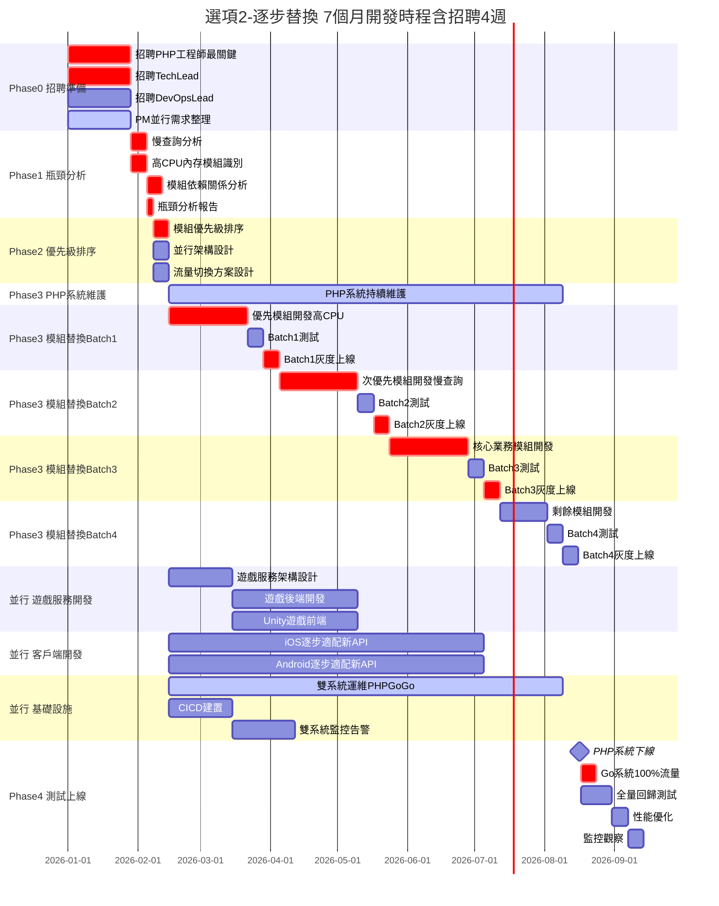
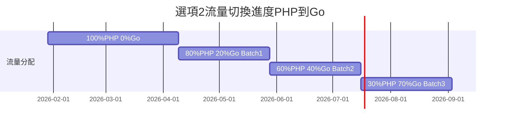
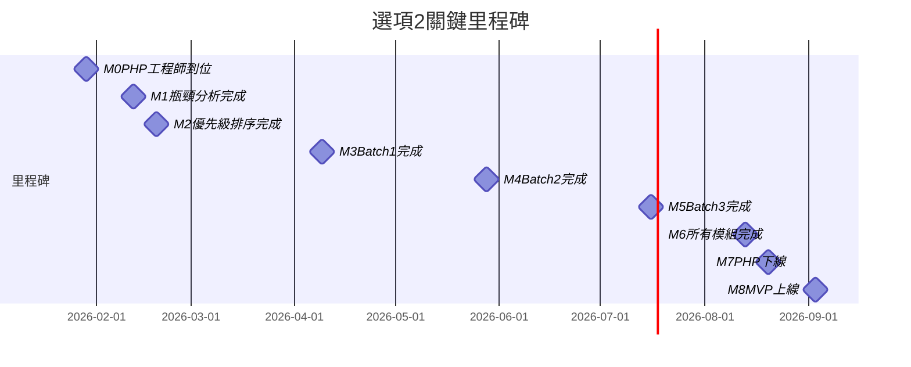
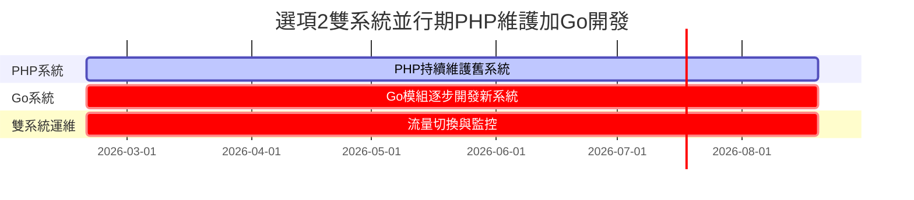

# PK Live 2.0 - 選項2：逐步替換方案

> **版本**: v1.0 | **日期**: 2026-01-13  
> **適用條件**: 有外包代碼，PHP 系統可繼續運行

---

## 📋 方案概述

**核心策略**：維護 PHP 系統運行，同時逐批開發 Go 微服務替換模組，最終淘汰 PHP

**適用條件**：
- ✅ 能拿到外包代碼
- ✅ PHP 系統可繼續運行
- ✅ 可承受雙系統維護成本
- ✅ 風險厭惡型組織

**不適用條件**：
- ❌ PHP 系統已無法運行
- ❌ 人力資源不足（需要 22-28 人）
- ❌ 需要快速上線（時程最長）

---

## 🎯 關鍵優勢

| 優勢 | 說明 |
|------|------|
| **風險最低** | 雙系統並行，隨時可回滾 |
| **業務連續** | 不影響現有用戶，平滑遷移 |
| **漸進式遷移** | 可根據優先級逐步替換，降低技術風險 |
| **團隊學習** | 邊做邊學，積累經驗 |

---

## ⚠️ 關鍵風險

| 風險 | 影響程度 | 緩解措施 |
|------|---------|---------|
| **雙系統維護成本** | 高 | 盡快完成遷移，設定明確時間表 |
| **流量切換複雜** | 中 | 詳細的灰度方案，充分測試 |
| **時程最長** | 中 | 增加人力投入，加速開發 |
| **人力需求最多** | 高 | 分批招聘，優先招聘關鍵角色 |

---

## 👥 人力配置（22-28人）

### 特別說明

選項2 與選項1的差異：
- ✅ **新增 PHP 維護團隊（2-3人）**：持續維護 PHP 系統
- ✅ **DevOps 團隊更大（3-4人）**：需維護雙系統
- ✅ **人力需求最多（22-28人）**

### MVP 階段（7個月，實際開發 5.25個月）

| 團隊 | 人數 | 角色 | 優先級 | 關鍵職責 |
|------|------|------|--------|---------|
| **PHP 維護** | 2-3人 | 資深 PHP + 維護工程師 | P0 | PHP 系統維護、Bug 修復 |
| **Go 後端** | 6-7人 | Tech Lead + 5-6 工程師 | P0 | 微服務開發 |
| **遊戲服務** | 5-6人 | Tech Lead + 後端 + Unity | P1 | 遊戲功能開發 |
| **iOS** | 1-2人 | Team Lead + 工程師 | P0 | iOS App 適配 |
| **Android** | 1-2人 | Team Lead + 工程師 | P0 | Android App 適配 |
| **DevOps** | 3-4人 | Lead + 2-3 工程師 | P0 | 雙系統運維、流量切換 |
| **QA** | 1-2人 | Lead + 工程師 | P1 | 雙系統測試 |
| **UI/UX** | 1-2人 | 設計師 | P1 | 界面設計 |
| **管理** | 1-2人 | PM + PO | P0 | 項目管理 |
| **總計** | **22-28人** | - | - | - |

---

## 💰 成本估算

### 人力成本（7個月 MVP）

| 團隊 | 人數 | 月薪範圍 | 7個月總成本 |
|------|------|---------|------------|
| **PHP 維護** | 2-3人 | $7K-11K | $98K-231K |
| **Go 後端** | 6-7人 | $6K-10K | $252K-490K |
| **遊戲服務** | 5-6人 | $5K-9K | $175K-378K |
| **iOS** | 1-2人 | $6K-10K | $42K-140K |
| **Android** | 1-2人 | $6K-10K | $42K-140K |
| **DevOps** | 3-4人 | $7K-11K | $147K-308K |
| **QA** | 1-2人 | $5K-8K | $35K-112K |
| **UI/UX** | 1-2人 | $5K-9K | $35K-126K |
| **管理** | 1-2人 | $8K-12K | $56K-168K |
| **小計** | **22-28人** | - | **$882K-2.09M** |
| **實際工作 5.25 個月** | - | - | **$455K-980K** |

**說明**：
- 招聘期 1.5 個月
- 實際開發時間 5.25 個月
- 基礎設施與第三方成本待評估（需維護雙系統，成本較高）

---

## 📅 開發時程

### 階段劃分（36週 = 8個月）

| 階段 | 週數 | 關鍵任務 | 交付物 |
|------|------|---------|--------|
| **Phase 0: 招聘** | 4週 | 招聘 PHP 工程師（最關鍵） | 團隊到位 |
| **Phase 1: 分析** | 3週 | 瓶頸分析、優先級排序 | 替換計劃 |
| **Phase 2: 並行開發** | 25週 | 逐批替換模組（4 批） | 新系統模組 |
| **Phase 3: PHP 下線** | 1週 | PHP 系統下線 | Go 系統接管 |
| **Phase 4: 測試** | 3週 | 全量測試、性能優化 | 可上線版本 |

### 模組替換計劃（4 批）

| 批次 | 週數 | 模組 | 原因 | 流量分配 |
|------|------|------|------|---------|
| **Batch 1** | 7週 | 高 CPU 模組 | 影響性能 | PHP 80%, Go 20% |
| **Batch 2** | 7週 | 慢查詢模組 | 數據庫瓶頸 | PHP 60%, Go 40% |
| **Batch 3** | 7週 | 核心業務模組 | 業務邏輯複雜 | PHP 30%, Go 70% |
| **Batch 4** | 4週 | 剩餘模組 | 完整替換 | PHP 5%, Go 95% |

### 流量切換策略

**漸進式切換時間表**：

```
第 7 週：  100% PHP, 0% Go    （初始狀態）
第 14 週：  80% PHP, 20% Go   （Batch 1 完成）
第 21 週：  60% PHP, 40% Go   （Batch 2 完成）
第 28 週：  30% PHP, 70% Go   （Batch 3 完成）
第 32 週：   5% PHP, 95% Go   （Batch 4 完成）
第 33 週：   0% PHP, 100% Go  （PHP 下線）
```

---

## 📊 甘特圖

### 完整開發甘特圖



### 流量切換時程



### 關鍵里程碑



### 雙系統並行示意圖



**圖表說明**：
- **紅色（crit）**：關鍵路徑（模組替換）
- **藍色（active）**：並行任務（PHP 維護、遊戲、客戶端）
- **橙色**：雙系統運維
- **綠色（milestone）**：流量切換節點

---

## 🔄 逐步替換流程

### Phase 1: 瓶頸分析（3週）

**Week 1: 慢查詢分析**
- 使用工具分析數據庫慢查詢
- 識別高頻慢查詢 SQL
- 評估優化可行性

**Week 2: 高 CPU/內存模組識別**
- 分析 CPU 使用率
- 識別內存洩漏問題
- 找出性能瓶頸模組

**Week 3: 模組優先級排序**
- 根據影響程度排序
- 制定替換計劃
- 輸出替換路線圖

### Phase 2: Batch 1 替換（7週）

**Week 1-5: 開發**
- 開發高 CPU 模組的 Go 版本
- 保持 API 接口兼容
- 編寫單元測試

**Week 6: 測試**
- 功能測試
- 性能測試
- 兼容性測試

**Week 7: 灰度上線**
- 10% 流量切換
- 監控觀察
- 逐步提升到 20%

### Phase 2: Batch 2-4（重複流程）

逐批替換剩餘模組，每批遵循相同流程：
1. 開發（5-7週）
2. 測試（1週）
3. 灰度上線（1週）

### Phase 3: PHP 下線（1週）

- 最後 5% 流量切換
- PHP 系統停止服務
- 歸檔 PHP 代碼
- 慶祝完成遷移 🎉

---

## 🎯 關鍵成功因素

### 1. PHP 工程師的重要性

**為什麼 PHP 工程師是最關鍵？**
- 負責瓶頸分析和優先級排序
- 持續維護 PHP 系統
- 協助 Go 團隊理解業務邏輯
- 確保平滑過渡

**招聘建議**：
- 5年+ PHP 經驗
- 熟悉性能分析工具（Xdebug、New Relic）
- 有系統遷移經驗
- 最好有 Go 基礎

### 2. 雙系統運維

**DevOps 團隊的挑戰**：
- 同時維護 PHP 和 Go 兩套環境
- 流量切換機制（Nginx/Kong）
- 雙倍的監控和告警
- 數據同步問題

**解決方案**：
- 使用統一的監控平台（Prometheus + Grafana）
- 自動化部署腳本
- 詳細的 Runbook

### 3. 流量切換風險控制

**灰度上線checklist**：
```
[ ] 1. 確認新模組功能完全等價
[ ] 2. 準備回滾方案
[ ] 3. 設置監控告警
[ ] 4. 10% 流量測試 24 小時
[ ] 5. 無問題後提升到 20%
[ ] 6. 監控 3 天無異常
[ ] 7. 繼續提升流量
```

---

## 📝 下一步行動

### 立即執行（Week 1-2）

```
[ ] 1. 與外包商協商，獲取代碼訪問權
[ ] 2. 發布 PHP 工程師職位（資深，5年+，最關鍵）
[ ] 3. PM 開始整理需求文檔
[ ] 4. 評估雙系統運維成本
```

### 招聘完成後（Week 3-4）

```
[ ] 1. PHP 工程師開始瓶頸分析
[ ] 2. 招聘 Go Tech Lead 和 DevOps Lead
[ ] 3. PM 完成需求初稿
[ ] 4. 制定詳細的流量切換方案
```

### 分析完成後（Week 5-7）

```
[ ] 1. 輸出模組優先級排序報告
[ ] 2. 確定 4 批替換計劃
[ ] 3. 開始招聘其他團隊成員
[ ] 4. 準備雙系統運維環境
```

---

## 🔗 相關文檔

- **專案總覽**：三個方案的高階對比
- **選項1：重構**：快速重構方案
- **選項3：重做**：全新開發方案

---

**更新日期**：2026-01-13  
**版本**：v1.0  
**下一次更新**：瓶頸分析完成後
