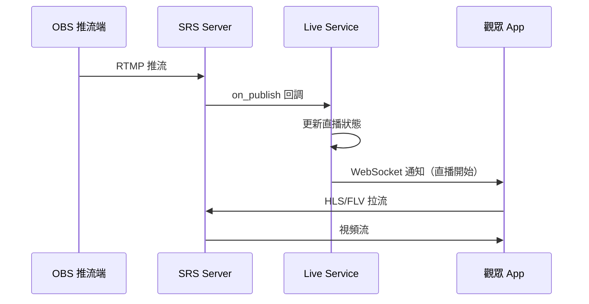
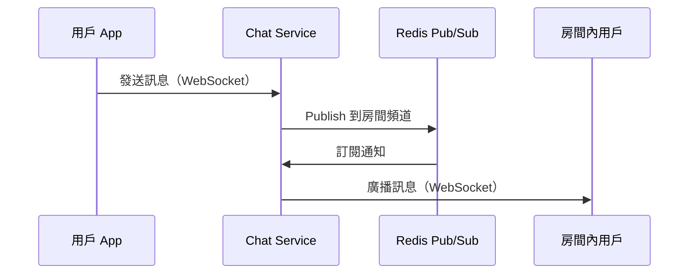
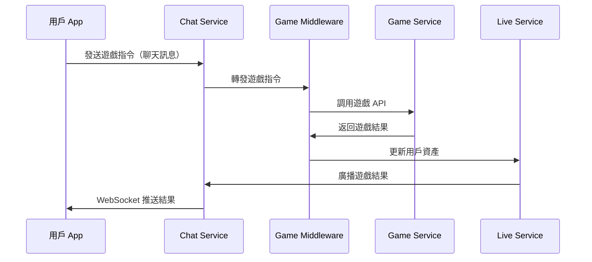
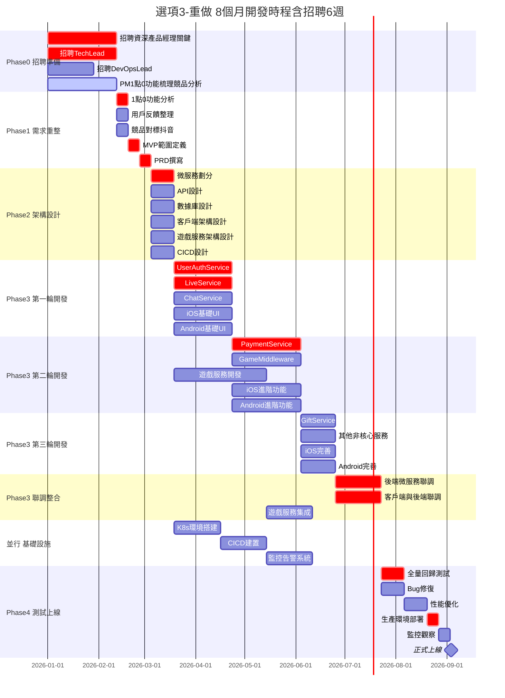
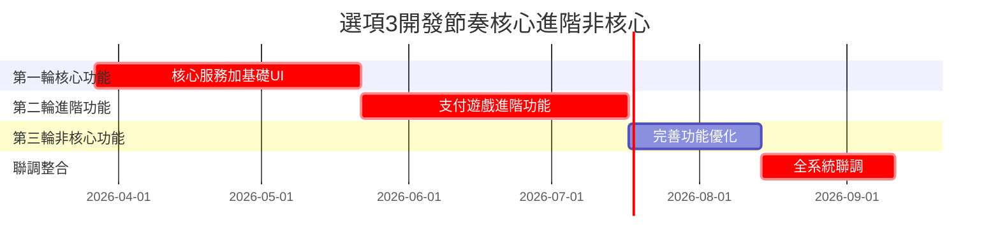
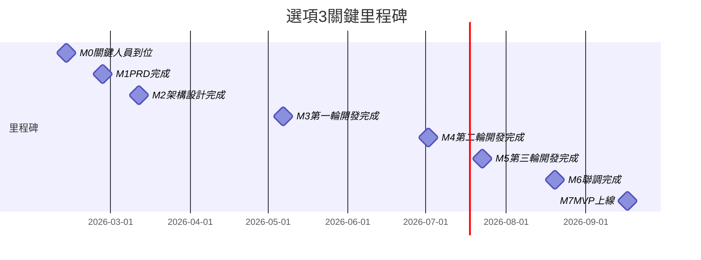
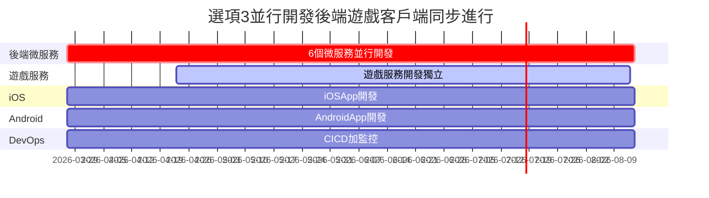
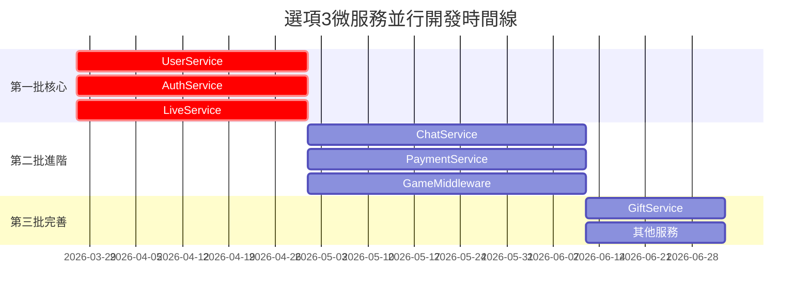

# PK Live 2.0 - 選項3：重做方案

> **版本**: v1.0 | **日期**: 2026-01-13  
> **適用條件**: 無代碼或質量太差

---

## 📋 方案概述

**核心策略**：完全重新開發，不依賴舊代碼，從零打造乾淨架構

**適用條件**：
- ✅ 無法獲取外包代碼
- ✅ 或代碼質量太差（<30%）
- ✅ 追求長期價值，乾淨架構
- ✅ 有充足預算和時間

**不適用條件**：
- ❌ 需要快速上線（MVP 需 9.5 個月）
- ❌ 預算有限
- ❌ 人力資源不足

---

## 🎯 關鍵優勢

| 優勢 | 說明 |
|------|------|
| **架構最乾淨** | 無技術債，可擴展性最好，長期維護成本最低 |
| **技術選型自由** | 可選擇最新技術棧，不受舊系統限制 |
| **文檔完整** | 從零開始，文檔齊全，知識沉澱完整 |
| **成本最明確** | 無隱藏成本，預算可控 |

---

## ⚠️ 關鍵風險

| 風險 | 影響程度 | 緩解措施 |
|------|---------|---------|
| **MVP 時程最長** | 高 | 增加人力並行開發，使用敏捷迭代 |
| **需求不明確** | 高 | 招聘資深產品經理，詳細競品分析 |
| **技術風險** | 中 | 技術選型要保守，POC 驗證 |
| **團隊磨合** | 中 | 提前建立開發規範，定期 Code Review |

---

## 👥 人力配置（22-27人）

### 特別說明

選項3 與選項1/2的差異：
- ✅ **無需 PHP 團隊**：全新開發
- ✅ **需要資深產品經理**：重新定義需求
- ✅ **客戶端人力更多**：iOS/Android 各 2 人
- ✅ **招聘期更長**：6 週（vs 4 週）

### MVP 階段（8個月，實際開發 5.5個月）

| 團隊 | 人數 | 角色 | 優先級 | 關鍵職責 |
|------|------|------|--------|---------|
| **Go 後端** | 6-7人 | Tech Lead + 5-6 工程師 | P0 | 微服務開發 |
| **遊戲服務** | 5-6人 | Tech Lead + 後端 + Unity | P1 | 遊戲功能開發 |
| **iOS** | 2人 | Team Lead + 工程師 | P0 | iOS App 全新開發 |
| **Android** | 2人 | Team Lead + 工程師 | P0 | Android App 全新開發 |
| **DevOps** | 2-3人 | Lead + 1-2 工程師 | P0 | CI/CD、監控 |
| **QA** | 1-2人 | Lead + 工程師 | P1 | 測試、Bug 追蹤 |
| **UI/UX** | 1-2人 | 設計師 | P1 | 界面設計 |
| **管理** | 2-3人 | 資深 PM + PM + PO | P0 | 項目管理、需求定義 |
| **總計** | **22-27人** | - | - | - |

---

## 💰 成本估算

### 人力成本（8個月 MVP）

| 團隊 | 人數 | 月薪範圍 | 8個月總成本 |
|------|------|---------|------------|
| **Go 後端** | 6-7人 | $6K-10K | $288K-560K |
| **遊戲服務** | 5-6人 | $5K-9K | $200K-432K |
| **iOS** | 2人 | $6K-10K | $96K-160K |
| **Android** | 2人 | $6K-10K | $96K-160K |
| **DevOps** | 2-3人 | $7K-11K | $112K-264K |
| **QA** | 1-2人 | $5K-8K | $40K-128K |
| **UI/UX** | 1-2人 | $5K-9K | $40K-144K |
| **管理** | 2-3人 | $8K-12K | $128K-288K |
| **小計** | **22-27人** | - | **$1.0M-2.14M** |
| **實際工作 5.5 個月** | - | - | **$440K-900K** |

### 基礎設施成本（8個月）

| 項目 | 月成本 | 8個月總成本 | 說明 |
|------|--------|------------|------|
| **雲端主機** | $2K-3K | $16K-24K | K8s 集群（3-5 節點）|
| **數據庫** | $800-1.2K | $6.4K-9.6K | RDS PostgreSQL |
| **Redis** | $300-500 | $2.4K-4K | ElastiCache |
| **對象存儲** | $200-400 | $1.6K-3.2K | S3/OSS（錄影、頭像）|
| **CDN** | $500-800 | $4K-6.4K | CloudFront/CDN |
| **監控日誌** | $300-500 | $2.4K-4K | Prometheus + ELK |
| **負載均衡** | $100-200 | $800-1.6K | ALB/NLB |
| **總計** | $4.2K-6.6K | **$33.6K-52.8K** | - |

### 第三方服務成本（8個月）

| 項目 | 月成本 | 8個月總成本 | 說明 |
|------|--------|------------|------|
| **短信驗證** | $300-500 | $2.4K-4K | Twilio/阿里雲 |
| **推送通知** | $200-400 | $1.6K-3.2K | Firebase/極光 |
| **支付手續費** | $500-1K | $4K-8K | Stripe/支付寶（2-3%）|
| **郵件服務** | $100-200 | $800-1.6K | SendGrid/AWS SES |
| **第三方 API** | $200-400 | $1.6K-3.2K | 各種第三方服務 |
| **總計** | $1.3K-2.5K | **$10.4K-20K** | - |

### MVP 總成本匯總

| 成本類別 | 低估 | 高估 | 備註 |
|---------|------|------|------|
| **人力成本** | $440K | $900K | 22-27 人 × 5.5 個月 |
| **基礎設施成本** | $34K | $53K | 雲端資源 |
| **第三方服務成本** | $10K | $20K | API 與服務 |
| **總計** | **$484K** | **$973K** | MVP 可上線 |

---

## 📅 開發時程

### 階段劃分（40週 = 9.5個月）

| 階段 | 週數 | 關鍵任務 | 交付物 |
|------|------|---------|--------|
| **Phase 0: 招聘** | 6週 | 招聘資深產品經理（關鍵） | 團隊到位 |
| **Phase 1: 需求** | 5週 | 1.0 功能分析、競品對標 | PRD 文檔 |
| **Phase 2: 設計** | 2週 | 架構設計、API 設計 | 設計文檔 |
| **Phase 3: 開發** | 20週 | 三輪開發（核心→進階→完善）| MVP 功能 |
| **Phase 4: 聯調** | 4週 | 全系統聯調、集成測試 | 可測試版本 |
| **Phase 5: 測試** | 3週 | Bug 修復、性能優化 | 可上線版本 |

### 三輪開發策略

| 輪次 | 週數 | 內容 | 目標 |
|------|------|------|------|
| **第一輪** | 8週 | User、Auth、Live、基礎 UI | 核心功能可運行 |
| **第二輪** | 8週 | Payment、Chat、Game、進階功能 | 商業化功能 |
| **第三輪** | 4週 | Gift、其他、優化 | 完整功能 |

### 關鍵里程碑

| 里程碑 | 時間 | 說明 |
|--------|------|------|
| M0: 關鍵人員到位 | 第6週 | 資深 PM、Tech Lead 到位 |
| M1: PRD 完成 | 第11週 | 需求文檔完成 |
| M2: 架構設計完成 | 第13週 | 微服務拆分、API 設計完成 |
| M3: 第一輪開發完成 | 第21週 | 核心服務完成 |
| M4: 第二輪開發完成 | 第29週 | 進階服務完成 |
| M5: 第三輪開發完成 | 第33週 | 所有服務完成 |
| M6: 聯調完成 | 第37週 | 可進入測試 |
| M7: MVP 上線 | 第40週 | 正式發布 |

---

## 🏗️ 技術架構

### 系統架構圖

```mermaid
graph TB
    Client[客戶端<br/>iOS + Android]
    Gateway[API Gateway<br/>Nginx/Kong]
    Backend[微服務集群<br/>Go Services]
    GameMW[遊戲中介層<br/>Game Middleware]
    GameSvc[遊戲服務<br/>獨立主理]
    SRS[SRS 直播<br/>Live Stream]
    Infra[基礎設施<br/>Infrastructure]
    
    Client -->|HTTPS| Gateway
    Gateway -->|Load Balance| Backend
    Backend -->|Internal API| GameMW
    GameMW -->|API| GameSvc
    Client -->|RTMP 推流| SRS
    Client -->|HLS/FLV 拉流| SRS
    Backend -->|控制| SRS
    Backend -->|Data| Infra
    GameSvc -->|Data| Infra
    
    style Client fill:#2C3E50
    style Gateway fill:#34495E
    style Backend fill:#E67E22
    style GameMW fill:#9B59B6
    style GameSvc fill:#8E44AD
    style SRS fill:#16A085
    style Infra fill:#7F8C8D
```



### 數據流向圖

**推流流程**：



**聊天流程**：



**遊戲對接流程**：



### 技術棧選型

| 層級 | 技術 | 原因 |
|------|------|------|
| **後端** | Go + Gin | 高性能、易維護、學習曲線平緩 |
| **數據庫** | PostgreSQL | 可靠性高、功能完整、開源免費 |
| **緩存** | Redis | 高性能、支持多種數據結構 |
| **消息隊列** | RabbitMQ/Kafka | 解耦服務、異步處理 |
| **直播** | SRS（自架） | 開源、可控制、低成本 |
| **容器** | Docker + K8s | 易部署、易擴展 |
| **監控** | Prometheus + Grafana | 開源、功能強大 |
| **日誌** | ELK Stack | 集中管理、易查詢 |

### 微服務劃分

| 服務 | 職責 | 技術 |
|------|------|------|
| **User Service** | 用戶管理、資料維護 | Go + PostgreSQL |
| **Auth Service** | 認證、授權、JWT | Go + Redis |
| **Live Service** | 直播間管理、狀態控制 | Go + PostgreSQL + SRS |
| **Chat Service** | 聊天、彈幕、WebSocket | Go + Redis |
| **Payment Service** | 支付、虛擬貨幣 | Go + PostgreSQL |
| **Game Middleware** | 遊戲中介層 | Go + Redis |
| **Gift Service** | 禮物、特效 | Go + PostgreSQL |

---

## 📊 甘特圖

### 完整開發甘特圖



### 三輪開發示意圖



### 關鍵里程碑



### 並行開發示意圖



### 微服務開發時間線



**圖表說明**：
- **紅色（crit）**：關鍵路徑（核心開發）
- **藍色（active）**：並行開發（客戶端、遊戲）
- **綠色（milestone）**：里程碑（三輪開發完成）

---

## 🔄 三輪開發詳解

### 第一輪：核心功能（8週）

**目標**：讓系統「能跑起來」

**後端**：
- User Service：用戶註冊、登入、資料管理
- Auth Service：JWT 認證、權限管理
- Live Service：直播間創建、狀態管理

**客戶端**：
- iOS/Android：基礎 UI、登入、直播間列表
- 基本直播功能（推流/拉流）

**遊戲服務**：
- 架構設計
- 基礎 API 開發

### 第二輪：進階功能（8週）

**目標**：讓系統「能賺錢」

**後端**：
- Payment Service：支付、虛擬貨幣
- Chat Service：聊天、彈幕
- Game Middleware：遊戲對接

**客戶端**：
- iOS/Android：支付流程、聊天界面
- 遊戲玩法集成

**遊戲服務**：
- 遊戲後端開發
- Unity 前端開發

### 第三輪：完善功能（4週）

**目標**：讓系統「體驗好」

**後端**：
- Gift Service：禮物、特效
- 其他非核心服務

**客戶端**：
- iOS/Android：完善功能、優化體驗
- Bug 修復、性能優化

**全系統**：
- 聯調測試
- 性能優化
- 安全加固

---

## 🎯 關鍵成功因素

### 1. 資深產品經理的重要性

**為什麼需要資深產品經理？**
- 沒有舊系統可參考
- 需要重新定義產品需求
- 需要對標競品（抖音）
- 需要平衡 MVP 範圍

**招聘建議**：
- 5年+ 產品經驗
- 有直播產品經驗
- 熟悉抖音等競品
- 有 0 to 1 經驗

### 2. 技術選型的重要性

**選型原則**：
- 成熟穩定 > 新潮酷炫
- 開源方案 > 商業方案（降低成本）
- 團隊熟悉 > 學習曲線
- 社區活躍 > 小眾框架

**POC 驗證**：
- 在正式開發前，做 2 週 POC
- 驗證技術可行性
- 評估性能指標
- 確保團隊能駕馭

### 3. 文檔的重要性

**必須文檔**：
- PRD（產品需求文檔）
- API 文檔
- 架構設計文檔
- 數據庫設計文檔
- 部署文檔
- 運維手冊

**文檔規範**：
- 使用 Markdown
- 版本控制（Git）
- 定期更新
- Code Review 時同步更新

---

## 📝 下一步行動

### 立即執行（Week 1-2）

```
[ ] 1. 發布資深產品經理職位（最關鍵）
[ ] 2. 發布 Go Tech Lead 職位
[ ] 3. 開始競品分析（抖音、快手）
[ ] 4. 準備技術選型文檔
```

### 招聘完成後（Week 3-6）

```
[ ] 1. 產品經理開始需求分析
[ ] 2. 分析 1.0 用戶反饋
[ ] 3. 定義 MVP 範圍
[ ] 4. 招聘其他團隊成員
```

### 需求完成後（Week 7-13）

```
[ ] 1. 輸出 PRD 文檔
[ ] 2. 架構設計
[ ] 3. 技術選型 POC
[ ] 4. 準備開發環境
```

---

## 🔗 相關文檔

- **專案總覽**：三個方案的高階對比
- **選項1：重構**：快速重構方案
- **選項2：逐步替換**：漸進式遷移方案

---

**更新日期**：2026-01-13  
**版本**：v1.0  
**下一次更新**：PRD 完成後
