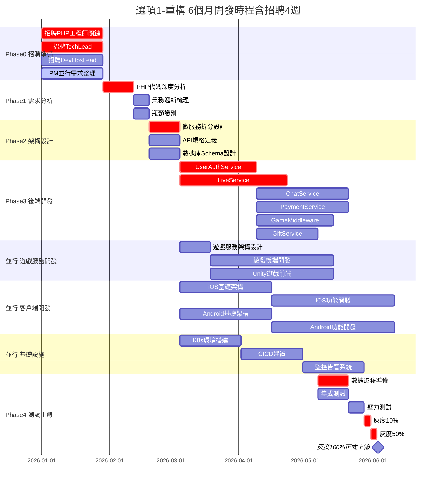
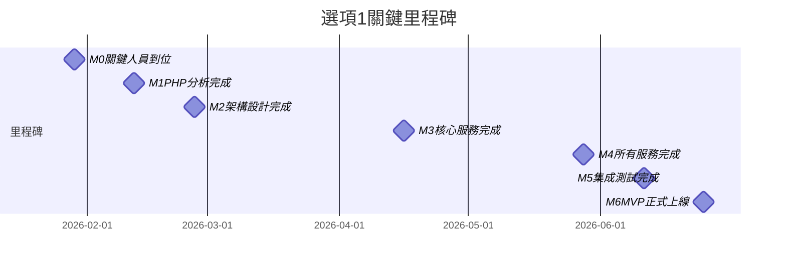
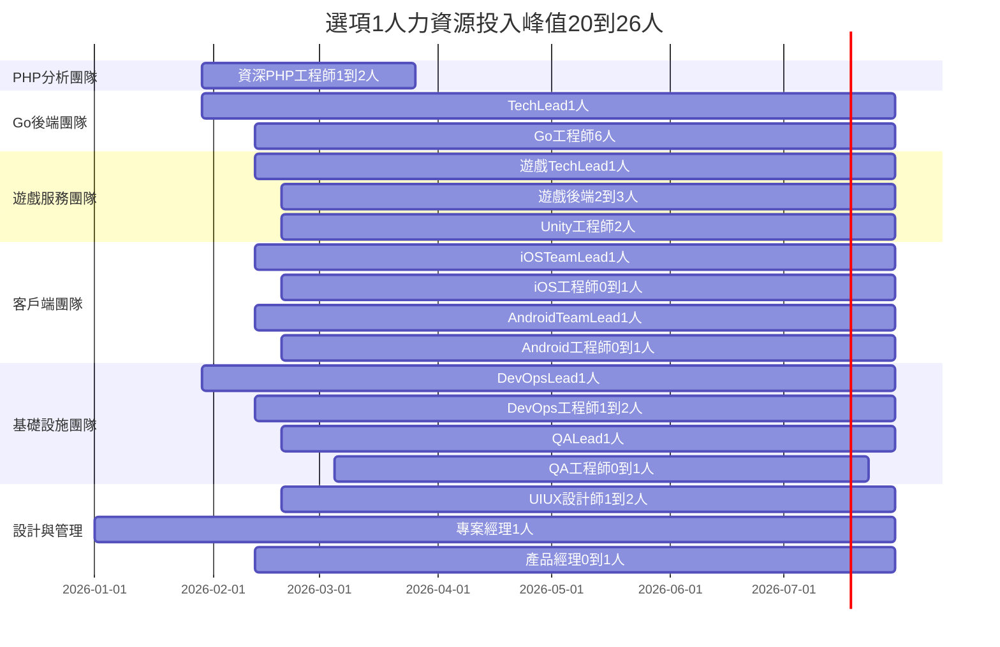
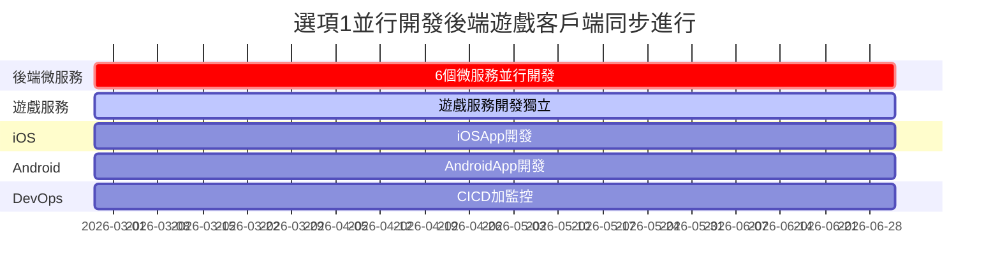

# 選項1：重構 - 甘特圖

> **版本**: v1.0  
> **更新日期**: 2026-01-13  
> **適合轉換**: Google Sheets

---

## 完整開發甘特圖（可視化）

---

## 關鍵里程碑

---

## 人力資源投入時間表

---

## 並行開發示意圖

---

**版本**: v1.0  
**更新日期**: 2026-01-13  
**總時程**: 30 週（7.5 個月，含招聘 4 週）  
**關鍵路徑**: 招聘 → PHP 分析 → 架構設計 → 微服務開發 → 測試上線
