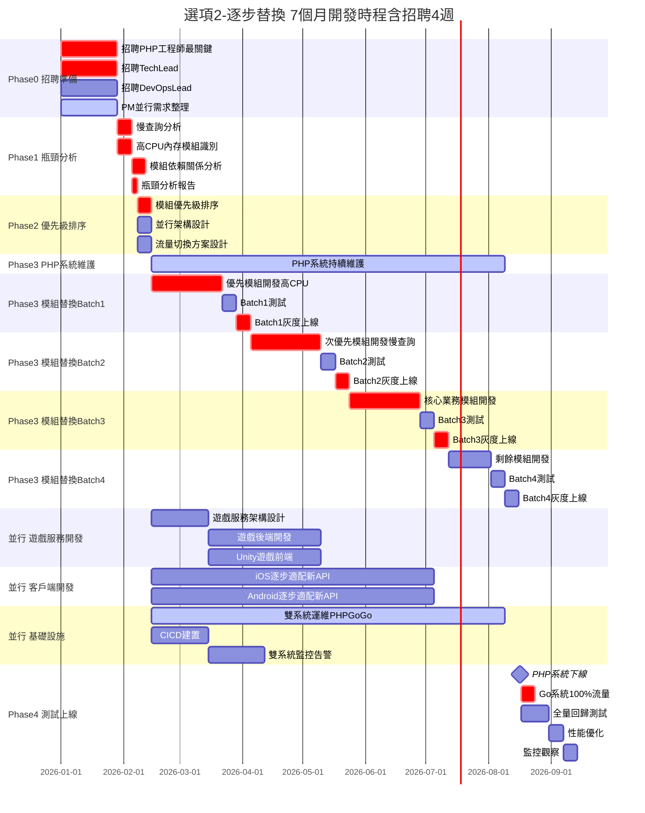
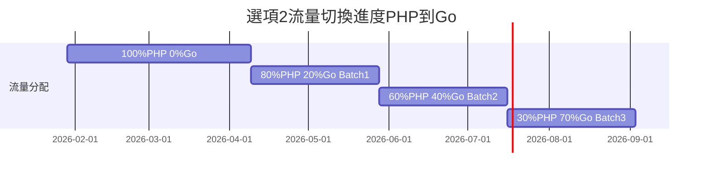
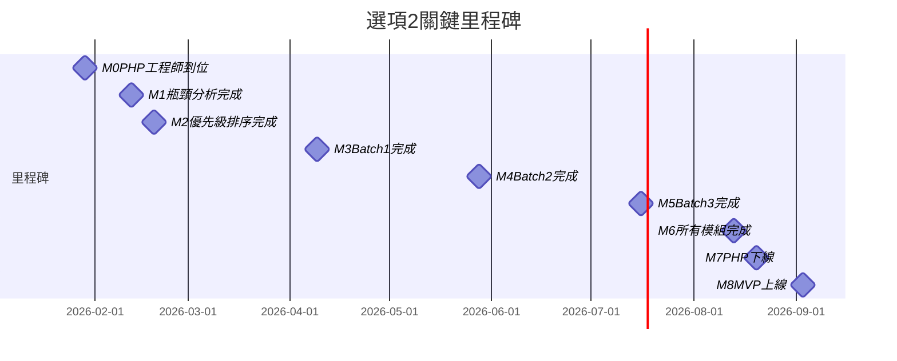
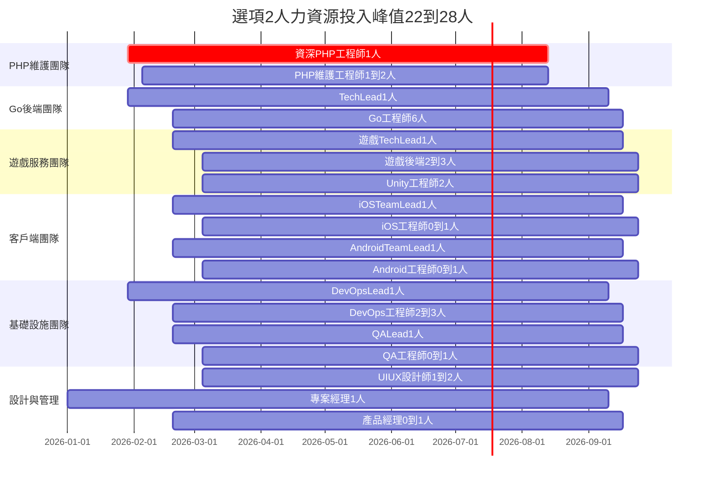
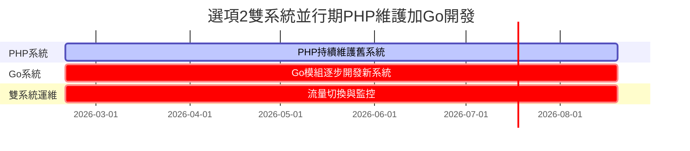

# 選項2：逐步替換 - 甘特圖

> **版本**: v1.0  
> **更新日期**: 2026-01-13  
> **適合轉換**: Google Sheets

---

## 完整開發甘特圖（可視化）

---

## 流量切換時程（逐步遷移）

---

## 關鍵里程碑

---

## 人力資源投入時間表

---

## 雙系統並行示意圖

---

**版本**: v1.0  
**更新日期**: 2026-01-13  
**總時程**: 36 週（8 個月，含招聘 4 週）  
**關鍵路徑**: 招聘 PHP → 瓶頸分析 → 優先級排序 → 逐批替換 → PHP 下線  
**特點**: 雙系統並行，風險最低
