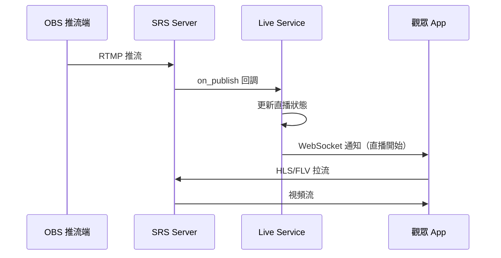
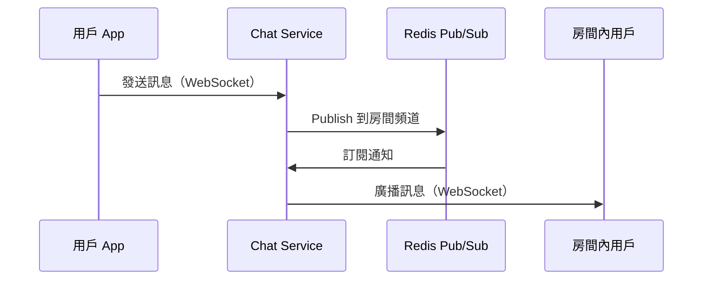
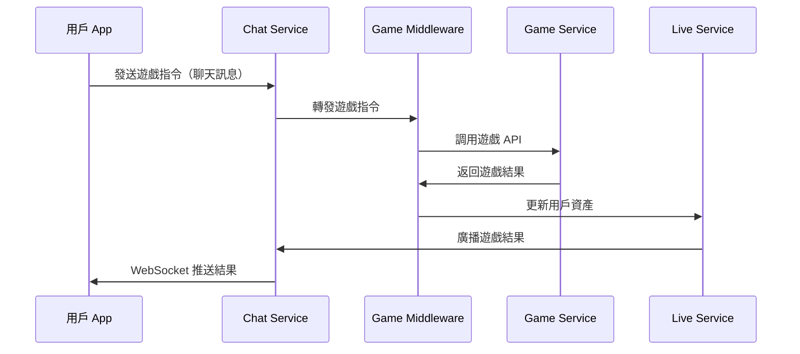

# 選項3：重做 - 目標架構設計

> **版本**: v1.0  
> **更新日期**: 2026-01-13  
> **適合轉換**: Google Sheets

---

## 整體架構

### 系統架構圖

```mermaid
graph TB
    Client[客戶端<br/>iOS + Android]
    Gateway[API Gateway<br/>Nginx/Kong]
    Backend[微服務集群<br/>Go Services]
    GameMW[遊戲中介層<br/>Game Middleware]
    GameSvc[遊戲服務<br/>獨立主理]
    SRS[SRS 直播<br/>Live Stream]
    Infra[基礎設施<br/>Infrastructure]
    
    Client -->|HTTPS| Gateway
    Gateway -->|Load Balance| Backend
    Backend -->|Internal API| GameMW
    GameMW -->|API| GameSvc
    Client -->|RTMP 推流| SRS
    Client -->|HLS/FLV 拉流| SRS
    Backend -->|控制| SRS
    Backend -->|Data| Infra
    GameSvc -->|Data| Infra
    
    style Client fill:#2C3E50
    style Gateway fill:#34495E
    style Backend fill:#E67E22
    style GameMW fill:#9B59B6
    style GameSvc fill:#8E44AD
    style SRS fill:#16A085
    style Infra fill:#7F8C8D
```

---

## 微服務拆分

### 核心微服務（6個）

| 服務名稱 | 職責 | 技術棧 | 端口 |
|---------|------|--------|------|
| **User Service** | 用戶註冊、登入、個人資料 | Go + PostgreSQL | 8001 |
| **Auth Service** | JWT 認證、權限管理 | Go + Redis | 8002 |
| **Live Service** | 直播間管理、推拉流 | Go + SRS API | 8003 |
| **Chat Service** | 即時聊天、WebSocket | Go + Redis | 8004 |
| **Payment Service** | 支付、禮物、道具 | Go + PostgreSQL | 8005 |
| **Game Middleware** | 遊戲對接中介層 | Go | 8006 |

### 遊戲服務（獨立）

| 服務名稱 | 職責 | 技術棧 |
|---------|------|--------|
| **Game Service** | 遊戲邏輯、結算 | Go/Java/C# + PostgreSQL |
| **Game Frontend** | 遊戲 UI | Unity |

---

## 數據流向

### 推流流程（OBS → SRS）

### 聊天流程（WebSocket）

### 遊戲對接流程

---

## 技術棧

### 後端

| 組件 | 技術選型 | 版本 |
|------|---------|------|
| **開發語言** | Go | 1.21+ |
| **Web 框架** | Gin | Latest |
| **WebSocket** | Gorilla WebSocket | Latest |
| **數據庫** | PostgreSQL | 15+ |
| **緩存** | Redis | 7+ |
| **消息隊列** | RabbitMQ / Kafka | Latest |
| **直播服務** | SRS | 5.0+ |

### 客戶端

| 平台 | 技術選型 | 架構模式 |
|------|---------|---------|
| **iOS** | Swift | MVVM |
| **Android** | Kotlin | MVVM |

### 遊戲服務

| 組件 | 技術選型 |
|------|---------|
| **後端** | Go / Java / C# |
| **前端** | Unity |

### 基礎設施

| 組件 | 技術選型 |
|------|---------|
| **容器化** | Docker |
| **編排** | Kubernetes (K8s) |
| **CI/CD** | GitLab CI / GitHub Actions |
| **監控** | Prometheus + Grafana |
| **日誌** | ELK Stack |
| **服務發現** | Consul |

---

## API 設計原則

### RESTful API 規範

| 方法 | 路徑 | 說明 |
|------|------|------|
| GET | /api/v1/users/:id | 獲取用戶資料 |
| POST | /api/v1/auth/login | 用戶登入 |
| GET | /api/v1/rooms | 獲取直播間列表 |
| POST | /api/v1/rooms | 創建直播間 |
| WS | /ws/chat/:room_id | WebSocket 聊天連接 |

### 認證方式

| 類型 | 方式 | 有效期 |
|------|------|--------|
| **用戶認證** | JWT Token | 7 天 |
| **Token 刷新** | Refresh Token | 30 天 |
| **WebSocket** | Token in Query | 連接期間 |

---

## 數據庫設計

### 核心表結構

| 表名 | 說明 | 主要字段 |
|------|------|---------|
| **users** | 用戶表 | id, username, email, password_hash |
| **rooms** | 直播間表 | id, title, host_id, status, stream_key |
| **messages** | 聊天訊息表 | id, room_id, user_id, content, created_at |
| **gifts** | 禮物表 | id, name, price, image_url |
| **orders** | 訂單表 | id, user_id, amount, status, created_at |

### 數據庫分片策略

| 表 | 分片鍵 | 說明 |
|------|--------|------|
| **messages** | room_id | 按直播間分片 |
| **orders** | user_id | 按用戶分片 |

---

## 部署架構

### 開發環境

| 服務 | 部署方式 | 副本數 |
|------|---------|--------|
| **微服務** | Docker Compose | 1 |
| **PostgreSQL** | Docker | 1 |
| **Redis** | Docker | 1 |
| **SRS** | Docker | 1 |

### 生產環境

| 服務 | 部署方式 | 副本數 |
|------|---------|--------|
| **微服務** | K8s Deployment | 2-5 |
| **PostgreSQL** | K8s StatefulSet | 1 主 + 1 從 |
| **Redis** | K8s StatefulSet | 1 主 + 2 從 |
| **SRS** | K8s Deployment | 2-3 |
| **API Gateway** | K8s Deployment | 2 |

---

## 安全設計

### 安全措施

| 項目 | 實施方式 |
|------|---------|
| **HTTPS** | Let's Encrypt SSL 證書 |
| **DDoS 防護** | CloudFlare / WAF |
| **JWT 認證** | RS256 簽名，7 天有效期 |
| **API 限流** | Redis + Token Bucket |
| **SQL 注入防護** | ORM + 參數化查詢 |
| **XSS 防護** | 輸入過濾 + 輸出轉義 |
| **數據加密** | AES-256 敏感數據加密 |
| **日誌脫敏** | 自動脫敏敏感信息 |

---

## 監控與告警

### 監控指標

| 類別 | 指標 | 告警閾值 |
|------|------|---------|
| **系統** | CPU 使用率 | > 80% |
| **系統** | 內存使用率 | > 85% |
| **系統** | 磁盤使用率 | > 90% |
| **應用** | API 響應時間 | > 500ms |
| **應用** | API 錯誤率 | > 1% |
| **數據庫** | 慢查詢 | > 1s |
| **直播** | 推流中斷 | 立即告警 |

---

## 擴展性設計

### 水平擴展

| 組件 | 擴展方式 | 觸發條件 |
|------|---------|---------|
| **API Gateway** | 增加 Pod 副本 | CPU > 70% |
| **微服務** | 增加 Pod 副本 | CPU > 70% |
| **PostgreSQL** | 讀寫分離 + 分片 | QPS > 10000 |
| **Redis** | Cluster 模式 | 內存 > 80% |
| **SRS** | 增加節點 | 並發 > 1000 |

---

**版本**: v1.0  
**更新日期**: 2026-01-13
