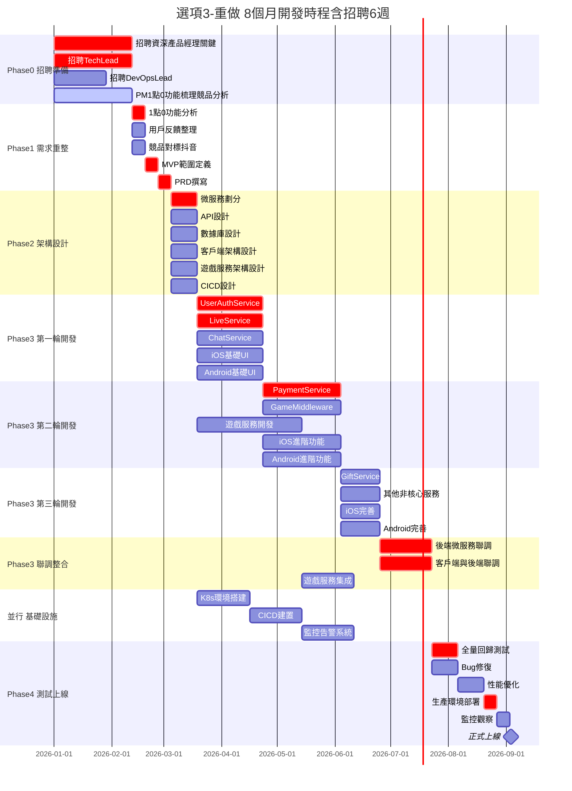
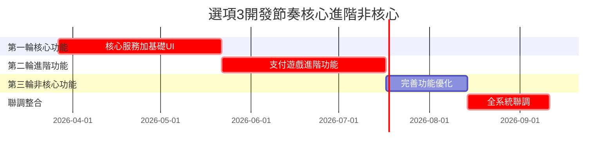
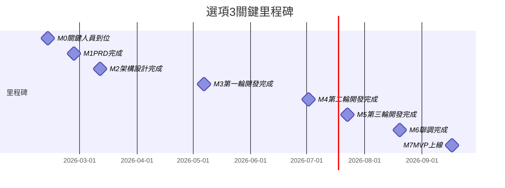
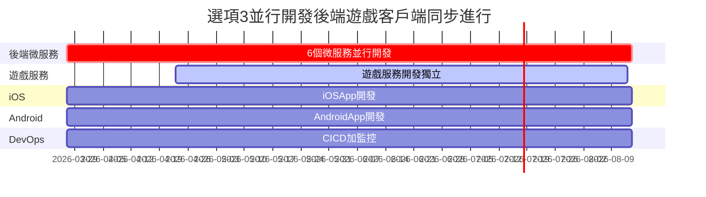
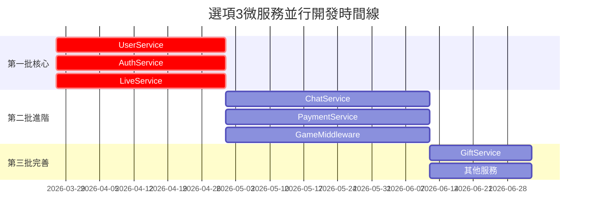

# 選項3：重做 - 甘特圖

> **版本**: v1.0  
> **更新日期**: 2026-01-13  
> **適合轉換**: Google Sheets

---

## 完整開發甘特圖（可視化）

---

## 三輪開發示意圖

---

## 關鍵里程碑

---

## 並行開發示意圖

---

## 微服務開發時間線

---

**版本**: v1.0  
**更新日期**: 2026-01-13  
**總時程**: 38 週（9.5 個月，含招聘 6 週）  
**關鍵路徑**: 招聘資深產品 → 需求重整 → 架構設計 → 三輪開發 → 聯調 → 上線  
**特點**: 全新開發，架構最乾淨，無技術債
